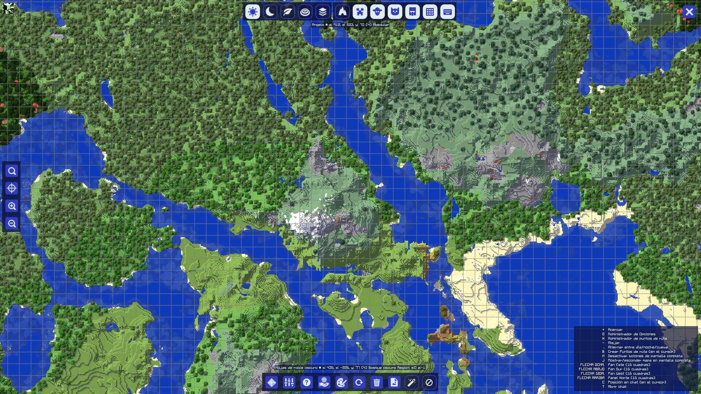

## **Uso básico**

Una vez que tenga JourneyMap [instalado](installing.md), todo lo que necesita hacer es unirse a un servidor o cargar un mundo para un solo jugador.

En su mayor parte, JourneyMap funciona desde el primer momento. ¡Todo lo que necesitas hacer para empezar  a mapear tu mundo es comenzar a explorarlo! El área a su alrededor se mapeará automáticamente a medida que viaje y será visible en cada uno de los tres tipos de mapas que admite JourneyMap.

## **Asignaciones de Teclas**

Las siguientes asignaciones de teclas están disponibles de forma predeterminada cuando juegas en un servidor mundial o multijugador.

- ++j++ - Mostrar/ocultar el mapa en pantalla completa
- ++ctrl+j++ - Mostrar/ocultar el mini-mapa
- ++equal+minus++ - Acerca y aleja el mini-mapa respectivamente
- ++bracket-left++ - Cambia el tipo de mapa que se muestra en el mini-mapa
- ++bar++ - Cambiar entre ajustes preestablecidos de mini-mapa
- ++b++ - Crea [un punto de ruta](waypoints.md) donde estás parado actualmente
- ++ctrl+b++ - Abra el [administrador de puntos de ruta](waypoints.md) (esto entra en conflicto con la combinación de teclas del narrador, por lo que es posible que desee cambiarla o desactivarla)
- ++z++ - Alterna la visibilidad de todos los puntos de ruta

Todas las teclas especificadas en la documentación se pueden personalizar en la configuración propia de Minecraft. Simplemente abra el menú (de forma predeterminada, con la tecla ++esc++), haga clic en Opciones y luego en Controles, y verá dos nuevas categorías para todas las teclas de JourneyMap.

## **Marcadores**

Todos los tipos de mapas contienen marcadores. Estos marcadores denotan diversos datos, como la posición de una entidad o [un punto de ruta](waypoints.md) en el mapa.

| Icono                                                         | Descripción                                                                    |
|---------------------------------------------------------------|--------------------------------------------------------------------------------|
| {: .center} | Tu posición en el mapa. *Nota: este ícono tiene un borde  blanco dentro del juego.*     |
| {: .center}           | [Un punto de ruta](waypoints.md). El color se puede configurar en el administrador de puntos de ruta. |
| {: .center}     | [Un Punto de muerte](waypoints.md)                                               |

| Icono                                                                  | Descripción                                                                                      |
|-----------------------------------------------------------------------|--------------------------------------------------------------------------------------------------|
| {: .center}           | Un marcador que indica una entidad en el mapa. El color  del marcador indica el tipo de entidad. |
| {: .center} | Una entidad por debajo de usted.                                                                             |
| {: .center}     | Una entidad por encima de ti.                                                                             |

| Icono                                                       | Descripción                       |
|-------------------------------------------------------------|-----------------------------------|
| {: .center}   | Una entidad neutral, como un animal. |
| {: .center} | Un aldeano                       |
| {: .center}   | Otro jugador                   |
| {: .center}     | Una entidad hostil, como un monstruo. |

Los marcadores y su visualización se pueden personalizar en el [administrador de configuración](settings/minimap.md).

## **Mini-Mapa**

De forma predeterminada, el mini-mapa se mostrará en la esquina superior derecha de la pantalla.

{: .center}

Este es tu mini-mapa. De forma predeterminada, muestra el área alrededor de tu personaje, así como información básica y las posiciones de tu personaje, otros jugadores, animales y monstruos.

El mini-mapa se puede acercar y alejar en cualquier momento presionando cualquiera de las teclas de zoom (por defecto, las teclas ++equal++ y ++minus++).

Las cuatro líneas de texto encima y debajo del mini-mapa se conocen como espacios de información. De forma predeterminada, muestran (en orden):

- La hora actual en el mundo real.
- La hora actual en el juego.
- La coordenada de tu personaje.
- El bioma actual en el que se encuentra tu personaje.

El mini-mapa y sus espacios de información se pueden personalizar en el [administrador de configuración](settings/minimap.md).

## **Mapa en Pantalla Completa**

Al presionar la tecla del mapa de pantalla completa (de forma predeterminada, la tecla J), puede abrir el mapa en pantalla completa.

{: .center}

Este mapa le brinda una vista desplazable de todas las áreas del mapa que ha explorado hasta ahora, mostradas como estaban cuando las descubrió. También proporciona acceso a la configuración de JourneyMap y a una serie de opciones de visualización de mapas.

Para obtener más información sobre el mapa en pantalla completa, consulte la [página del mapa en pantalla completa](settings/full-screen-map.md).

## **Mapa Web**

Una vez habilitado en el [administrador de configuración](settings/webmap.md), el mapa web le permite ver y explorar su mapa generado en un navegador web, incluido el acceso a él desde otro dispositivo (como un teléfono o tableta). Esto funcionará mientras el juego esté funcionando.

{: .center}

Para obtener más información sobre el mapa web, consulte [página del mapa web](settings/webmap.md).
