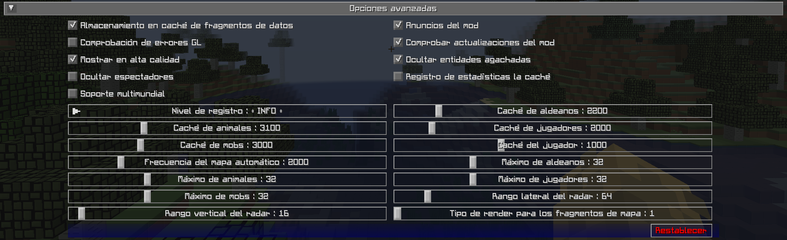

# **Configuración Avanzada**

Esta sección contiene configuraciones avanzadas para usuarios avanzados y aquellos que deseen modificar algunas de las partes internas de JourneyMap.

!!! warning "Advertencia"

 La configuración de esta sección puede tener efectos extremos en el rendimiento de su cliente. No recomendamos tocar estas configuraciones a menos que comprenda bien lo que está haciendo o que un miembro del personal de soporte de JourneyMap se lo indique.

 Si modificar estas configuraciones bloquea su cliente o hace que su computadora se retrase terriblemente, no diga que no le avisamos.

{: .center}

## **Alternar**

Las configuraciones de alternancia en **negrita** que aparecen a continuación están habilitadas de forma predeterminada.

| Alternar | Descripción |
|----------------------------|-------------------- -------------------------------------------------- -------------------------------------------------- ---------------------------------|
| **Anuncios del Mod** | Si anunciar en el chat cuando JourneyMap esté listo para usarse |
| **Comprobar actualizaciones del mod** | Si JourneyMap debería buscar actualizaciones sobre Curse |
| **Almacenamiento en caché de fragmentos de datos** | Habilita o deshabilita el almacenamiento en caché de fragmentos |
| Comprobación de errores GL | Activa o desactiva la comprobación de errores de OpenGL |
| **Ocultar entidades agachadas** | Si las entidades que se esconden o se agachan deben ocultarse |
| Ocultar espectadores | Si los espectadores deberían permanecer ocultos en el radar |
| **Mostrar en alta calidad** | Desmarque para mejorar el rendimiento del zoom y el uso de la memoria, pero reduce la calidad de visualización y el rendimiento de la rotación del minimapa cuando se establece en “Mi rumbo” |
| Soporte multimundial | Habilita o deshabilita el soporte multimundo. Nota: es posible que esto no funcione para todos los servidores. |
| Registro de estadísticas de caché | Esto está destinado a probadores beta: habilite el registro de estadísticas para cada caché |

## **Otras Configuraciones**

La opción predeterminada para cada configuración a continuación está marcada con **texto en negrita**.

| Configuración | Opciones | Descripción |
|--------------------------------|------------------------ -------------------------------------------------- -----------------------------------------|-- -------------------------------------------------- -------------------------------------------------- -------------------------------------------------- -------------------------------------------------- ---|
| Nivel de registro | <ul><li>**INFO**</li><li>TODO</li><li>DEPURACIÓN</li><li>ERROR</li><li>FATAL</li><li> APAGADO</li><li>RASTREO</li><li>ADVERTENCIA</li></ul> | Establezca qué tan detallados son los registros de JourneyMap, pero tenga en cuenta que algunos niveles de registro pueden causar graves problemas de rendimiento.
| Frecuencia del mapa automatico | Rango: 500 - 10000 (en ms)  El valor predeterminado es **2000** | Retraso entre tareas de región de mapa automático: valores más bajos harán que el mapa se genere más rápido, pero causarán caídas significativas en el rendimiento durante el mapeo |
| Caché de animales | Rango: 1000 - 10000 (en ms)  El valor predeterminado es **3100** | Durante cuánto tiempo se almacenan en caché los datos de radar de los animales: valores más bajos afectarán el rendimiento |
| Caché de mobs | Rango: 1000 - 10000 (en ms)  El valor predeterminado es **3000** | Durante cuánto tiempo se almacenan en caché los datos de radar de los mobs: valores más bajos afectarán el rendimiento |
| Caché del jugador | Rango: 500 - 2000 (en ms)  El valor predeterminado es **1000** | Durante cuánto tiempo se almacenan en caché los datos de tu personaje: valores más bajos afectarán el rendimiento |
| Caché de jugadores | Rango: 1000 - 10000 (en ms)  El valor predeterminado es **2000** | Durante cuánto tiempo se almacenan en caché los datos de radar de otros jugadores: valores más bajos afectarán el rendimiento |
| Tipo de render para los fragmentos de mapa | Rango: 1 - 4  El valor predeterminado es **1** | Cambie la estrategia de representación de los mosaicos del mapa si aparecen borrosos en su tarjeta de video:<ol type="1"><li>Lineal y reflejado</li><li>Lineal y fijado</li><li>Más cercano y reflejado </li><li>Más cercano y fijado</li></ol> |
| Máximo de animales | Rango: 1 - 128  El valor predeterminado es **32** | Número máximo de animales mostrados en el radar |
| Máximo de mobs | Rango: 1 - 128  El valor predeterminado es **32** | Número máximo de mobs mostrados en el radar |
| Máximo de jugadores | Rango: 1 - 128  El valor predeterminado es **32** | Número máximo de jugadores mostrados en el radar |
| Máximo de aldeanos | Rango: 1 - 128  El valor predeterminado es **32** | Número máximo de aldeanos mostrados en el radar |
| Rango lateral del radar  | Rango: 16 - 512 (en bloques)  El valor predeterminado es **64** | Distancia lateral para buscar entidades para mostrar en el radar: valores altos provocarán un impacto significativo en el rendimiento |
| Rango vertical del radar | Rango: 8 - 256 (en bloques)  El valor predeterminado es **16** | Distancia vertical para buscar entidades para mostrar en el radar: los valores altos provocarán un impacto significativo en el rendimiento |