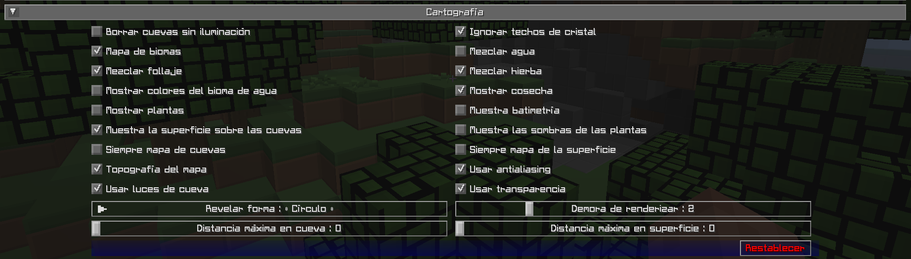

# **Configuración de Cartografía**

La configuración de cartografía le permite personalizar cómo se representa el mapa y qué se muestra en él.

{: .center}

## **Alternar**

Las configuraciones de alternancia en **negrita** que aparecen a continuación están habilitadas de forma predeterminada.

| Alternar | Descripción |
|------------------------------|------------------ -------------------------------------------------- ---------------------------------------|
| Siempre mapa de cuevas | Si mapear cuevas debajo de ti cuando estás en la superficie |
| Siempre mapa de la superficie | Ya sea para mapear la superficie sobre ti cuando estás en cuevas |
| **Mezclar follaje** | Si aplicar colores del bioma al follaje |
| **Mezclar hierba** | Ya sea para aplicar colores del bioma al césped |
| Mezclar agua | Ya sea para aplicar colores de biomas al agua |
| Borrar cuevas sin iluminación | Los bloques de corte interiores y apagados se muestran claros en lugar de negros. Esta opción sólo afecta a los bloques recién mapeados. |
| **Ignorar techos de cristal** | Si permanecer en modo superficie bajo un techo de cristal |
| **Mapa de biomas** | Ya sea para mostrar los colores del bioma en el mapa |
| **Topografía del mapa** | Ya sea para generar un mapa de contorno que muestre la elevación |
| Muestra batimetría | Si se debe mostrar el terreno submarino en el mapa |
| **Mostrar cosecha** | Si mostrar cultivos en el mapa |
| Muestra las sombras de las plantas | Si las plantas y los cultivos deberían proyectar sombras en el mapa |
| Mostrar plantas | Si mostrar plantas en el mapa |
| **Muestra la superficie sobre las cuevas** | Si se muestra una vista atenuada de la superficie en modo cueva |
| Mostrar colores del bioma de agua | Si mostrar acuarelas basadas en biomas |
| **Usar antialiasing** | Si se debe utilizar suavizado para mejorar el efecto de sombreado utilizado para mostrar la elevación |
| **Usar luces de cueva** | Ya sea para mostrar luces subterráneas: desactívelas para obtener un mapa completamente brillante |
| **Usar transparencia** | Si los bloques transparentes deberían revelar lo que hay debajo de ellos en el mapa |

## **Otras Configuraciones**

La opción predeterminada para cada configuración a continuación está marcada con **texto en negrita**.

| Configuración | Opciones | Descripción |
|---------------------|-------------------------- -------------------|------------------------------ -------------------------------------------------- -------------------------------------------------- -------------------------------------------------- ---|
| Revelar forma | <ul><li>Cuadrado</li><li>**Círculo**</li></ul> | Ya sea para revelar fragmentos en un círculo o en un cuadrado: los revelados circulares muestran menos fragmentos a la vez y, por lo tanto, funcionan mejor |
| Demora de renderizar | Rango: 0 - 10 (en segundos, predeterminado: **2**) | Con qué frecuencia JourneyMap debería intentar representar los fragmentos que te rodean. Los valores más altos pueden dar como resultado un mejor rendimiento, pero pueden provocar que se pierdan fragmentos cuando se viaja a alta velocidad |
| Distancia máxima en cueva | Rango: 0 - 32 (en fragmentos, predeterminado: **0**) | La distancia máxima dentro de la cual intentar renderizar el mapa mientras estás en una cueva; si configuras esto por encima de tu distancia de renderizado, se usará en su lugar |
| Distancia máxima en superficie | Rango: 0 - 32 (en fragmentos, predeterminado: **0**) | La distancia máxima dentro de la cual intentar renderizar el mapa mientras está sobre el suelo; si configura esto por encima de su distancia de renderizado, se usará en su lugar |
