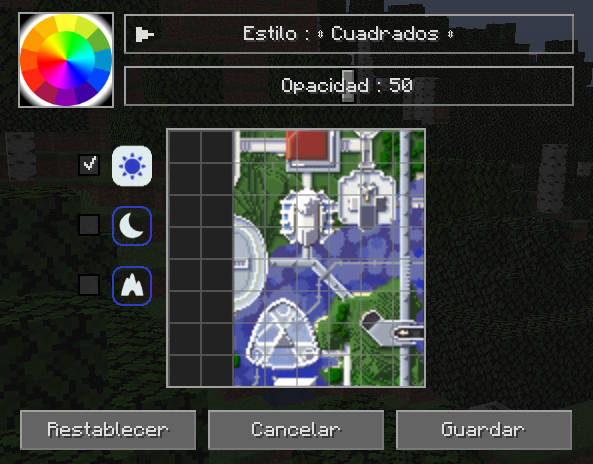

# **Configuración de Cuadrícula**

Tanto los ajustes preestablecidos del minimapa como el mapa de pantalla completa pueden tener una superposición de cuadrícula configurable. Puede personalizar esta superposición haciendo clic en el botón Editar cuadrícula… debajo de la configuración en cada categoría respectiva.

También puedes acceder a él desde el mapa en pantalla completa manteniendo presionada la tecla ++shift++ y haciendo clic en el botón de cuadrícula en la parte superior.

{: .center}

La cuadrícula describe fragmentos individuales en el mapa. Los estilos de cuadrícula que incluyen líneas de región dibujarán una cuadrícula adicional con líneas de diferentes colores para delinear las regiones del mundo en el mapa.

- Seleccione un color para las líneas de la cuadrícula haciendo clic en la rueda de colores.
- Seleccione el tipo de mapa (día, noche o cuevas) para editar en el lado izquierdo.
- Haga clic en el botón **Restablecer** para restablecer el tipo de mapa actual a la configuración de cuadrícula predeterminada.
- Haga clic en el botón **Cancelar** para descartar los cambios y cerrar el editor de cuadrícula.
- Haga clic en el botón **Guardar** para guardar los cambios y cerrar el editor de cuadrícula.

| Configuración | Opciones | Descripción |
|---------|------------------------------------------------ ---------------------|---------------------- -----------------|
| Estilo | **Cuadrados**, Cuadrados con regiónes, Regiónes, Puntos,Tablero | Cambiar el tipo de cuadrícula superpuesta en el mapa |
| Opacidad | Porcentaje: 0 - 100  **El valor predeterminado es 50** | Qué tan opaca debe dibujarse la cuadrícula |