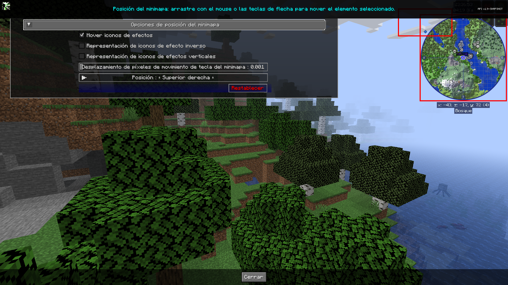

# **Configuración de Posición del Minimapa**

JourneyMap le permite configurar la ubicación tanto de los íconos de efectos como del minimapa real. Esto le permite a usted, como usuario, mover el minimapa y los íconos de efectos a donde desee en la pantalla.

{: .center}

## **Alternar**

Las configuraciones de alternancia en **negrita** que aparecen a continuación están habilitadas de forma predeterminada.

| Alternar | Descripción |
|--------------------------------|---------------- -------------------------------------------------- -------------|
| **Mover iconos de efectos** | Permite alejar los efectos de la poción del minimapa. |
| Representación de iconos de efecto inverso | Representación invertida de iconos. Vertical de abajo hacia arriba, Horizontal de izquierda a derecha |
| Representación de iconos de efecto vertical | Representación vertical de los iconos primero de arriba a abajo. |

## **Otras Configuraciones**

La opción predeterminada para cada configuración a continuación está marcada con texto **negrita**.

| Configuración | Opciones | Descripción |
|-------------------------------|----------------- -------------------------------------------------- -------------------------------------------------- -----------------------|-------------------------- -------------------------------------------------- ------------------------------------------------|
| Tecla del minimapa Mover desplazamiento de píxeles | <ul><li>Rango: 0,001 - 0,025  **El valor predeterminado es 0,001**</li></ul> | Al mover el minimapa con las teclas de flecha, esta opción controla la cantidad de píxeles por pulsación de tecla para ayudar a ajustar la ubicación. |
| Posición | <ul><li>**Arriba derecha**</li><li>Abajo derecha</li><li>Abajo izquierda</li><li>Arriba izquierda</li><li>Arriba centro</ li><li>Centro</li><li>Personalizado</li></ul> | Configúrelo en **Personalizado** para arrastrar el minimapa a la ubicación deseada. |