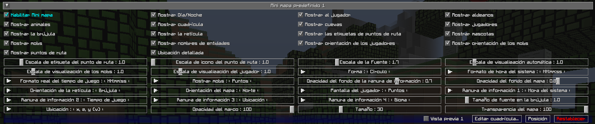
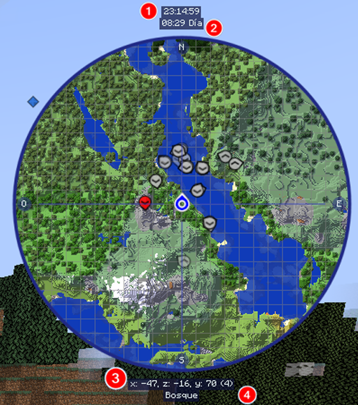

# **Configuración del Mini-mapa**

JourneyMap te permite tener dos ajustes preestablecidos de mini-mapa. Cada ajuste preestablecido representa un conjunto separado de configuraciones, lo que esencialmente le permite tener dos mini-mapas distintos disponibles para alternar.

!!! note "Nota"

 La configuración para cada mini-mapa es idéntica, por lo que solo cubriremos un ajuste preestablecido a continuación.

Para cambiar entre ajustes preestablecidos de mini-mapa, presione la tecla cambiar preestablecido de mini-mapa (la tecla ++backslash++ de forma predeterminada).

{: .center}

## **Alternar**

De forma predeterminada, todas las siguientes configuraciones de alternancia están habilitadas.

| Alternar | Descripción |
|---------------------|-------------------------- -----------------------------------------|
| Habilitar mini-mapa | Activar o desactivar este ajuste preestablecido de mini-mapa |
| Mostrar animales | Mostrar u ocultar animales |
| Mostrar Cuevas | Alternar cambio automático al modo cueva |
| Mostrar la brújula | Mostrar los puntos de la brújula alrededor del borde del mini-mapa |
| Mostrar Día/Noche | Alternar el cambio automático entre el modo día y noche |
| Mostrar nombres de entidades | Mostrar u ocultar nombres de entidades |
| Mostrar cuadrícula | Mostrar u ocultar la superposición de cuadrícula |
| Mostrar orientación de los mobs | Alternar mostrar en qué dirección se enfrentan los mobs/mounstros |
| Mostrar mobs | Mostrar u ocultar mobs |
| Mostrar mascotas | Mostrar u ocultar mascotas |
| Mostrar orientación de los jugadores | Mostrar en qué dirección miran otros jugadores |
| Mostrar jugadores | Mostrar u ocultar otros jugadores |
| Mostrar la retícula | Mostrar u ocultar líneas de punto medio que apuntan al centro del mini-mapa |
| Mostrar al jugador | Muestra u oculta tu propia ubicación y rumbo |
| Mostrar aldeanos | Mostrar u ocultar aldeanos |
| Mostrar las etiquetas de puntos de ruta | Mostrar u ocultar los nombres de los puntos de ruta |
| Mostrar puntos de ruta | Mostrar u ocultar todos los puntos de ruta |
| Ubicación detallada | Alternar entre una forma larga o corta de sus coordenadas actuales |

## **Ranuras de Información**

Los espacios de información son áreas de texto encima y debajo del mini-mapa que muestran información contextual adicional. Hay cuatro de ellos, numerados de arriba a abajo.

{: .center}

Todos los espacios de información se pueden configurar en uno de los siguientes:

- **En blanco**: Nada, oculta este espacio de información
- **Bioma**: el bioma en el que te encuentras actualmente.
- **Dimensión**: La dimensión en la que te encuentras actualmente
- **FPS**: el contador de FPS del juego.
- **Hora del juego**: el tiempo actual del juego, representado por el ciclo de luz diurna de Minecraft.
- **Tiempo de juego real**: el tiempo actual del juego, modificado para coincidir con un reloj real
- **Nivel de luz**: el nivel de luz del bloque en el que estás parado
- **Ubicación**: tus coordenadas actuales
- **Región**: las coordenadas de tu región actual
- **Hora del sistema**: La hora real actual, según su computadora

## **Otras Configuraciones**

La opción predeterminada para cada configuración a continuación está marcada con texto **negrita**.

| Configuración | Opciones | Descripción |
|------------------------------|------------------ -------------------------------------------------- -------------------------------------------------- -------------------------------------------------- ----------------------------------|--------------- -------------------------------------------------- ------------------------------------|
| Tamaño de fuente en la brújula | <ul><li>Rango: 0,5 - 4 **El valor predeterminado es 1**</li></ul> | La escala de fuente utilizada para las etiquetas de los puntos de la brújula |
| Escala de la fuente | <ul><li>Rango: 0,5 - 5 **El valor predeterminado es 1**</li></ul> | La escala de fuentes para etiquetas y texto |
| Opacidad del fondo de la ranura de información | <ul><li>Rango: 0 - 1  **El valor predeterminado es 0,7**</li></ul> | Ajusta la opacidad del fondo de la ranura de información. |
| Ubicación | <ul><li>**x, z, y (v)**</li><li>x, y, (v), z</li><li>x, z, y</li> <li>x, y, z</li><li>x, z</li></ul> | El formato de sus coordenadas, como se muestra en el mapa. |
| Opacidad del fondo del mapa | <ul><li>Rango: 0 - 1  **El valor predeterminado es 0,8**</li></ul> | Ajustar qué tan opaco es el marco del Mini-mapa (como porcentaje) |
| Orientación del mapa | <ul><li>**Norte**</li><li>Viejo Norte</li><li>Mi rumbo</li></ul> | La orientación (rotación) del Mini-mapa. Nota: Sólo Circulo admite el encabezado del mapa "Mi rumbo". |
| Mostrar mobs | <ul><li>**Puntos**</li><li>Iconos</li></ul> | Cómo se deben mostrar los mobs en el mapa. |
| Escala de visualizacion de los mobs | <ul><li>Rango: 0,01 - 5  **El valor predeterminado es 1**</li></ul> | La escala de los iconos y puntos de Mobs en el mapa. |
| Pantalla del jugador | <ul><li>**Puntos**</li><li>Iconos</li></ul> | Cómo deberían aparecer otros jugadores en el mapa. |
| Escala de visualización del jugador | <ul><li>Rango: 0,01 - 5  **El valor predeterminado es 1**</li></ul>                    | La escala de los iconos y puntos del jugador en el mapa. |
| Formato real del tiempo de juego | <ul><li>**HH:mm:ss**</li><li>H:mm:ss</li><li>HH:mm</li><li>H:mm</li ><li>hh:mm:ss a</li><li>h:mm:ss a</li><li>hh:mm:ss</li><li>h:mm:ss</li ><li>h:mm a</li><li>h:mm a</li><li>hh:mm</li><li>h:mm</li></ul> | El formato de texto del tiempo real del juego, como se muestra en un espacio de información. |
| Orientación de la retícula | <ul><li>**Brújula**</li><li>Mi rumbo</li></ul> | Cambia la orientación de la retícula. |
| Escala de visualización automática | <ul><li>Rango: 0,01 - 5  **El valor predeterminado es 1**</li></ul> | La escala de tu propio icono en el mapa. |
| Forma | <ul><li>**Círculo**</li><li>Cuadrado</li><li>Rectángulo</li></ul> | Cambia la forma del mini-mapa. |
| Formato de hora del sistema | <ul><li>**HH:mm:ss**</li><li>H:mm:ss</li><li>HH:mm</li><li>H:mm</li ><li>hh:mm:ss a</li><li>h:mm:ss a</li><li>hh:mm:ss</li><li>h:mm:ss</li ><li>h:mm a</li><li>h:mm a</li><li>hh:mm</li><li>h:mm</li></ul> | El formato de texto de la hora del sistema, como se muestra en un espacio de información. |
| Escala de icono del punto de ruta | <ul><li>Rango: 1 - 5  **El valor predeterminado es 1**</li></ul> | La escala de los iconos de punto de ruta en el mapa. |
| Escala de etiqueta del punto de ruta | <ul><li>Rango: 0,5 - 5  **El valor predeterminado es 1**</li></ul> | La escala de fuente para las etiquetas de puntos de ruta en el mapa. |
| Opacidad del marco | <ul><li>Rango 0 - 100  **El valor predeterminado es 100**</li><ul> | Qué tan opaco debe ser el marco alrededor del exterior del mini-mapa |
| Transparencia del mapa | <ul><li>Rango 0 - 100  **El valor predeterminado es 100**</li><ul> | Qué opaca debe ser la vista del mapa |
| Tamaño | <ul><li>Rango 0 - 100  **El valor predeterminado es 30**</li><ul> | Qué tamaño debe tener el mini-mapa, como porcentaje del tamaño de la ventana |