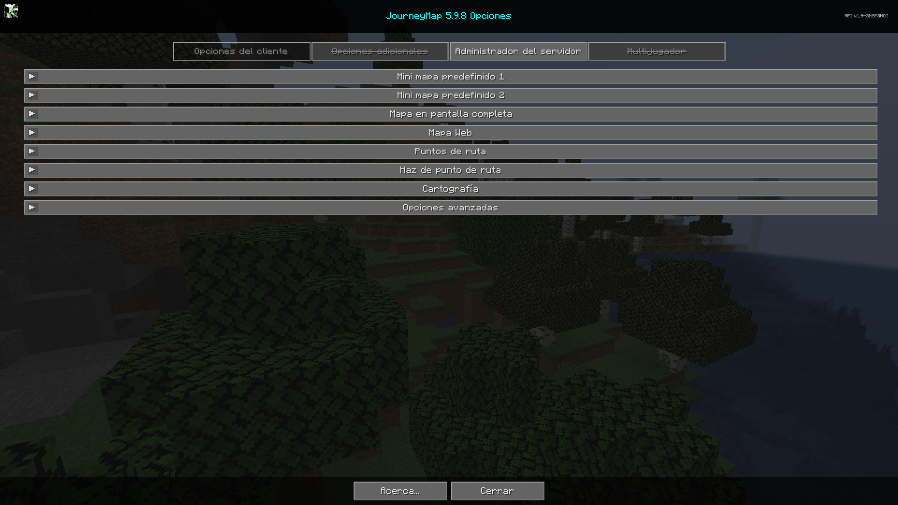

# **Ajustes**

JourneyMap proporciona más de unas pocas opciones de configuración, lo que te permite personalizar el comportamiento y la apariencia de muchos aspectos diferentes del mod. Todas estas configuraciones están disponibles a través del administrador de configuración.

{: .center}

Para acceder al administrador de configuración, abra el mapa en pantalla completa y haga clic en el botón de configuración en la parte inferior, o presione la tecla ++o++. Cada entrada de la lista representa una categoría específica de configuración; haga clic en ella para expandirla y ver las configuraciones que contiene.

!!! note "Nota"

 Cada categoría tiene un botón Restablecer. Tenga en cuenta que al presionar este botón se restablecerán las configuraciones de esa categoría a las configuraciones predeterminadas incluidas con JourneyMap, en lugar de simplemente descartar los cambios.