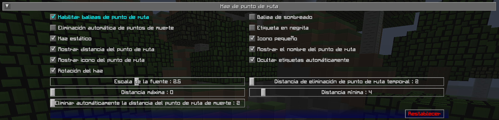

# **Configuración de Baliza de Punto de ruta**

De forma predeterminada, los puntos de referencia se muestran en el mundo mediante un haz de baliza en la distancia, lo que le permite ver dónde están desde cualquier parte del mundo. Puedes mirar hacia el haz y ver también el icono y la etiqueta del punto de ruta. Este comportamiento se puede personalizar a continuación.

{: .center}

## **Alternar**

Las configuraciones de alternancia en **negrita** que aparecen a continuación están habilitadas de forma predeterminada.

| Alternar | Descripción |
|-----------------------------|------------------- -----------------------------------------|
| **Habilitar balizas de punto de ruta** | Muestra balizas en el juego de tus puntos de referencia |
| Eliminación automática de puntos de muerte | Elimina automáticamente los puntos de referencia de la muerte a medida que te acercas a ellos |
| **Ocultar etiquetas automáticamente** | Ocultar etiquetas de puntos de ruta cuando no estés mirando hacia ellas |
| Etiqueta en negrita | Utilice etiquetas de puntos de ruta en negrita en las balizas |
| **Rotacion del haz** | Utilice un haz exterior giratorio para balizas de punto de ruta |
| **Mostrar distancia del punto de ruta** | Mostrar la distancia al punto de ruta en su etiqueta |
| **Mostrar icono del punto de ruta** | Mostrar el icono de un punto de ruta con su baliza |
| **Mostrar el nombre del punto de ruta** | Mostrar el nombre de un punto de ruta en su baliza |
| **Icono pequeño** | Utilice un icono pequeño para balizas de puntos de ruta |
| **Haz estatico** | Utilice un haz interior estatico para balizas de punto de ruta |

## **Otras Configuraciones**

La opción predeterminada para cada configuración a continuación está marcada con **texto en negrita**.

| Configuración | Opciones | Descripción |
|-----------------------------------------|---------- ------------------------------------------------|- -------------------------------------------------- ------------------|
| Escala de la fuente | <ul><li>Rango: 0,5 - 5  **El valor predeterminado es 1**</li></ul> | La escala de fuentes para etiquetas y texto |
| Eliminar automáticamente la distancia del punto de muerte | <ul><li>Rango: 2 - 64  **El valor predeterminado es 2**</li></ul> | La distancia a los puntos de ruta de muerte para eliminarlos automáticamente |
| Distancia máxima | <ul><li>Rango: 0 - 100000  **El valor predeterminado es 0**</li></ul> | La distancia máxima para mostrar puntos de ruta en |
| Distancia mínima | <ul><li>Rango: 0 - 64  **El valor predeterminado es 4**</li></ul> | La distancia mínima para mostrar puntos de ruta en |
| Distancia de eliminación de punto de ruta temporal | <ul><li>Rango: 0 - 64  **El valor predeterminado es 0**</li></ul> | La distancia desde el jugador cuando los puntos de referencia temporales se eliminan automáticamente. |
