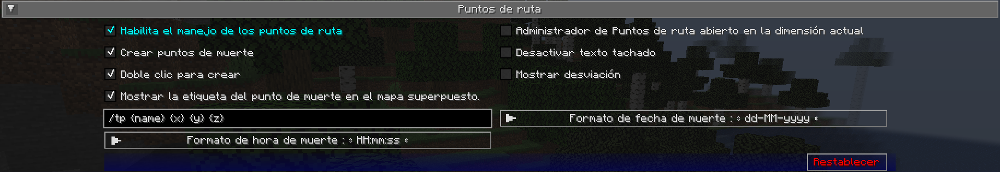

# **Configuración de Puntos de Ruta**

Esta categoría le permite cambiar algunas configuraciones relacionadas con cómo se comportan y se muestran los [puntos de ruta](../waypoints.md).
Los puntos de ruta también tienen una serie de configuraciones individuales; puedes conocerlas
en [la página de puntos de ruta.](../waypoints.md)

{: .center}

## **Alternar**

Las configuraciones de alternancia en **negrita** que aparecen a continuación están habilitadas de forma predeterminada.

| Alternar | Descripción |
|------------------------------------------------- ----|--------------------------------------------- -------------------------------------------------- ----|
| **Habilita el manejo de los puntos de ruta** | Habilite el administrador de puntos de ruta: puede deshabilitarlo si usa otro mod para administrar puntos de ruta |
| **Crear puntos de muerte** | Si se deben crear puntos de ruta de muerte cuando usted muera |
| Desactivar texto tachado | Desactiva el tachado del texto del waypoint | |
| **Mostrar la etiqueta del punto de muerte   en el mapa superpuesto** | Si se debe mostrar el nombre de los puntos de referencia de la muerte en el minimapa y en el mapa de pantalla completa |
| **Doble clic para crear** | Al hacer doble clic en el mapa en pantalla completa se creará un punto de referencia en la ubicación |
| Mostrar desviación | Muestra la desviación vectorial entre el jugador y el waypoint |
| Administrador de puntos de ruta abierto en la dimensión actual | Abre el administrador de puntos de ruta en la dimensión actual |

## **Otras Configuraciones**

La opción predeterminada para cada configuración a continuación está marcada con **texto en negrita**.

| Configuración | Opciones | Descripción |
|----------------------------------|-------------- -------------------------------------------------- -------------------------------------------------- -------------------------------------------------- --------------------------------------|----------- -------------------------------------------------- -------------------------------------------------- -------------------------------------------------- -------------------------------------------------- -------------------------------------------------- -------------------------------------------------- -------------------------------------------------- -------------------------------------------------- -------------------------------------------------- --------|
| Comando de teletransporte de waypoint personalizado | Entrada de texto: **/tp {nombre} {x} {y} {z}** | El comando de teletransporte que debe usarse cuando te teletransportas a un waypoint, usando los siguientes marcadores de posición: <ul><li>**{name}**: tu nombre de jugador</li><li>**{dim}** : La dimensión de destino</li><li>**{x}**: La coordenada X del waypoint</li><li>**{y}**: La coordenada Y del waypoint</li><li>* *{z}**: Coordenada Z del waypoint</li></ul> Esta configuración se ignora en un jugador o si JourneyMap está instalado en un servidor; la teletransportación ocurre sin un comando en ese caso. |
| Formato de fecha de muerte | <ul><li>**MM-dd-aaaa**</li><li>MM-dd-aa</li><li>dd-MM-aaaa</li><li>dd-MM- aa</li><li>aaaa-MM-dd</li><li>aa-MM-dd</li></ul> | El formato de texto de la fecha de muerte, como se muestra en la etiqueta del punto de ruta de muerte <ul><li>**dd**: Día</li><li>**MM**: Mes</li><li> **yy**: Año (2 dígitos)</li><li>**yyyy**: Año (4 dígitos)</li></ul> |
| Formato de hora de muerte | <ul><li>**HH:mm:ss**</li><li>H:mm:ss</li><li>HH:mm</li><li>H:mm</li ><li>hh:mm:ss a</li><li>h:mm:ss a</li><li>hh:mm:ss</li><li>h:mm:ss</li ><li>h:mm a</li><li>h:mm a</li><li>hh:mm</li><li>h:mm</li></ul> | El formato de texto de la hora de la muerte, como se muestra en la etiqueta del punto de de muerte |
