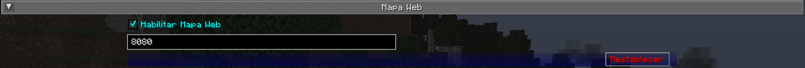

# **Configuración del Mapa Web**

El mapa web es una forma completamente diferente de ver tu mapa: en un navegador web en lugar de directamente desde Minecraft. Esto le permite tener una vista de mapa visible en otra pantalla, ¡o incluso en otro dispositivo!

{: .center}

!!! info "importante"

 Hay muchas configuraciones en esta categoría que no hacen nada en este momento. En cambio, el mapa web se configura utilizando su propia interfaz; consulte la página del mapa web para obtener más información al respecto.

 Debido a esto, a continuación sólo se documentan las configuraciones que realmente hacen algo.

## **Alternar**

De forma predeterminada, **ninguna** de las siguientes configuraciones de alternancia está habilitada. Deberá habilitar el mapa web antes de poder usarlo.

| Alternar | Descripción |
|----------------|-------------------------------- ---------------------|
| Habilitar mapa web | Si el mapa web debe estar habilitado y accesible |

!!! note "Nota"

 Si bien hay una entrada para proporcionar un puerto para que lo utilice el mapa web, actualmente se ignora. JourneyMap intentará utilizar el puerto 8080 de forma predeterminada; si no está disponible, intentará encontrar un puerto que sí lo esté.

 El puerto correcto siempre se muestra en el chat cuando el mapa web está habilitado.