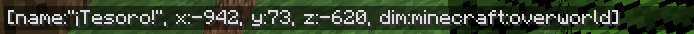
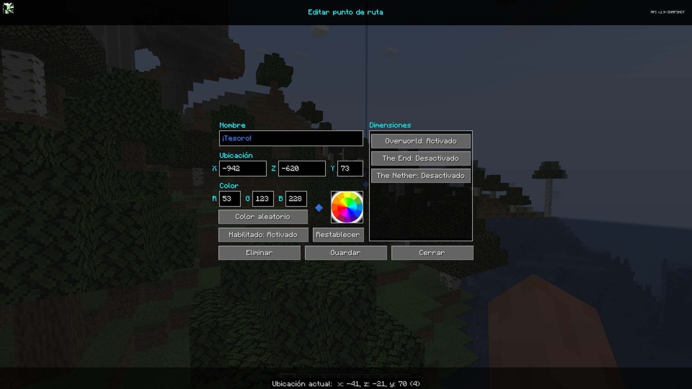

# **Puntos de Ruta**

Los puntos de ruta le permiten marcar ubicaciones específicas en su mapa, para realizar un seguimiento de esas ubicaciones o encontrar fácilmente el camino de regreso a ellas más tarde.

Además, los puntos de muerte se crean cuando, por ejemplo, [un esqueleto con una trompeta](https://www.curseforge.com/minecraft/mc-mods/trumpet-skeleton-redefinido) te arroja por el borde de un acantilado.
De forma predeterminada, se muestran usando un haz de baliza de color, el nombre y ícono del punto de ruta se mostrarán cuando mires hacia él, pero este comportamiento se puede cambiar en el [administrador de configuración](settings/overview.md). Los puntos de muerte también se pueden desactivar allí, si se prefiere.

!!! warning "Advertencia"

 Si está utilizando OptiFine, es probable que no pueda ver los puntos de ruta en el mundo. No estamos seguros de qué causa esto. Para obtener más información, consulte nuestra página de solución de problemas.

{: .center}

Puede crear puntos de ruta utilizando uno de los siguientes métodos:

- Presionando ++b++ dentro del juego para crear uno donde estás parado
- Al hacer doble clic o presionar ++b++ en el [mapa de pantalla completa](full-screen-map.md) para crear un punto de ruta en el cursor
- Abriendo el administrador de puntos de ruta y creandolo manualmente.

## **Gestión de Puntos de Ruta**

El administrador de puntos de ruta proporciona un lugar único para, como es de esperar, administrar sus puntos de ruta. Puedes abrirlo de las siguientes maneras:

- Presionando ++ctrl+b++ dentro del juego
- Abriendo el [mapa de pantalla completa](full-screen-map.md) y haciendo clic en el botón del administrador de puntos de ruta en la parte inferior

{: .center}

El administrador de puntos de ruta le brinda una lista de todos sus puntos de ruta y ofrece algunas opciones para administrarlos. En la parte inferior se encuentran los siguientes botones:

- **Opciones**: abra el [administrador de configuración](settings/overview.md)
- **Nuevo**: crea un nuevo punto de ruta
- **Dimensión**: filtrar los puntos de ruta mostrados según la dimensión
- **Cerrar**: cierra el administrador de puntos de ruta.

Cada punto de ruta tiene las siguientes opciones disponibles:

- **Teletransporte**: si el servidor lo permite, teletransporta directamente al punto de ruta
- **Buscar**: busque el punto de ruta en el [mapa de pantalla completa](full-screen-map.md)
- **Activado/Desactivado**: alterna la visibilidad del punto de ruta dentro del juego
- **Eliminar**: elimina el punto de ruta
- **Editar**: abre el editor de puntos de ruta
- **Chat**: Copie la información del punto de ruta en el cuadro de chat, como se muestra:
{: .center}

## **Edición de Puntos de Ruta**

Al crear o editar un punto de ruta, se muestra la siguiente pantalla:

{: .center}

El editor de punto de ruta proporciona las siguientes configuraciones para cada punto de ruta:

- **Nombre**: este nombre para mostrar para el punto de ruta
- **Ubicación**: la posición de este punto de ruta
- **Dimensiones**: alterna las dimensiones dentro de las cuales debe habilitarse el punto de ruta.
- **Habilitado**: si este punto de ruta está habilitado y debe ser visible
- **Color**: el color del punto de ruta, expresado en valores rojo, verde y azul.

También puedes hacer clic en la rueda de colores para elegir un color, o hacer clic en el botón Color aleatorio para obtener un color nuevo.

Esto es lo que hace cada uno de los otros botones:

- **Eliminar**: elimina el punto de ruta por completo
- **Restablecer**: deshace las ediciones del punto de ruta actual
- **Guardar**: guarda los cambios que has realizado en el punto de ruta.
- **Cerrar**: cierra el editor y descarta tus cambios.

## **Compartir Puntos de Ruta**

A partir de JourneyMap 5.2, ahora puedes compartir fácilmente puntos de ruta y ubicaciones con otros jugadores en el servidor. El objetivo de esta característica era agregar comodidad para todos los que usan JourneyMap, pero no lo hagas molesto para las personas que no lo saben. Si un jugador no tiene JourneyMap, seguirá viendo la ubicación en su chat en un formato amigable para los humanos.

Cuando aparece una ubicación con el formato adecuado en el chat de Minecraft, puedes **hacer clic** en ella (para crear un punto de ruta) o **controlar y hacer clic** en ella (para ver la ubicación en tu mapa en pantalla completa).

## **Comandos de Punto de Ruta**

En JourneyMap 5.8.5, se agregó un nuevo comando que le permite crear, eliminar y recargar puntos de ruta desde el chat.

**Recargar Puntos de Ruta**

- Recarga puntos de ruta. en el directorio de puntos de ruta. sin tener que reiniciar.
- Se utiliza principalmente al colocar archivos de puntos de ruta en la carpeta mientras se ejecuta el juego.

```texto
/jm reload
```

Los comandos de creación y eliminación solo están disponibles cuando el servidor tiene JourneyMap instalado y si el jugador tiene op. Puede encontrar más información sobre los comandos para agregar y eliminar [aquí](../Server%20Docs/Commands/waypoint_command.md).

## **Cómo Compartir Puntos de Ruta y Ubicaciones**

Puedes compartir Puntos de Ruta y ubicaciones de una de estas tres maneras:

1. En Administrador de Puntos de Ruta, presione el nuevo botón **Chat** junto a un Punto de Ruta. La ubicación se pegará en la interfaz de usuario del chat. Agregue algo de contexto si lo desea y luego presione Entrar. Puede usar esto con /msg o canales de servidor (si están presentes).
2. En la interfaz de usuario del chat, escriba <code>/jm ~</code> y presione Entrar. El comando será reemplazado con su ubicación actual. Agregue información o edite según sea necesario, luego presione Entrar.
3. En la interfaz de usuario del chat, escriba manualmente una ubicación entre corchetes. Vea las opciones de formato de ubicación a continuación:

## **Formato de Ubicación**

Una ubicación debe tener como mínimo las coordenadas x y z, pero cualquiera de las siguientes es posible y el orden que uses no importa:

- [x:#,z:#]
- [x:#, y:#, z:#]
- [x:#, y:#, z:#, dim:#]
- [x:#, y:#, z:#, dim:#, nombre:texto]
- [nombre:texto, dim:#, x:#, z:#, y:#]

Una ubicación consta de 2 o más pares ''nombre:valor'', separados por comas. Se admite cualquiera de los siguientes valores:

- x (entero) **obligatorio**
- y (entero)
- z (entero) **obligatorio**
- dim (entero)
- nombre (cadena, sin comillas, sin comas)
