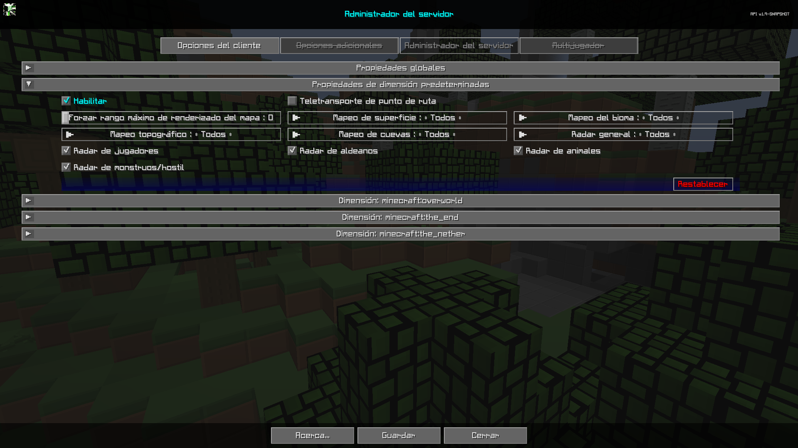

# **Propiedades de Dimensión Predeterminadas**

La categoría Propiedades de dimensión predeterminadas contiene configuraciones que serán las configuraciones predeterminadas para todas las dimensiones nuevas creadas. Estas configuraciones se pueden alternar según la dimensión.

{: .center}

## **Alternar**

| Alternar | Descripción |
|----------------------|------------------------- -------------------------------------------------- ---------------|
| Habilitar | Al habilitar esta dimensión se anularán las propiedades globales de esta dimensión. |
| Teletransportación de puntos de referencia | Permite o impide el teletransporte mediante el administrador de los puntos de ruta y el menú contextual de pantalla completa |
| Radar de jugadores | Si los jugadores pueden ver a otros jugadores en el mapa. |
| Radar de aldeanos | Si los jugadores pueden ver a los aldeanos en el mapa. |
| Radares de animales | Si los jugadores pueden ver animales en el mapa. |
| Radar de monstruos/hostil | Si los jugadores pueden ver monstruos o entidades hostiles en el mapa. |