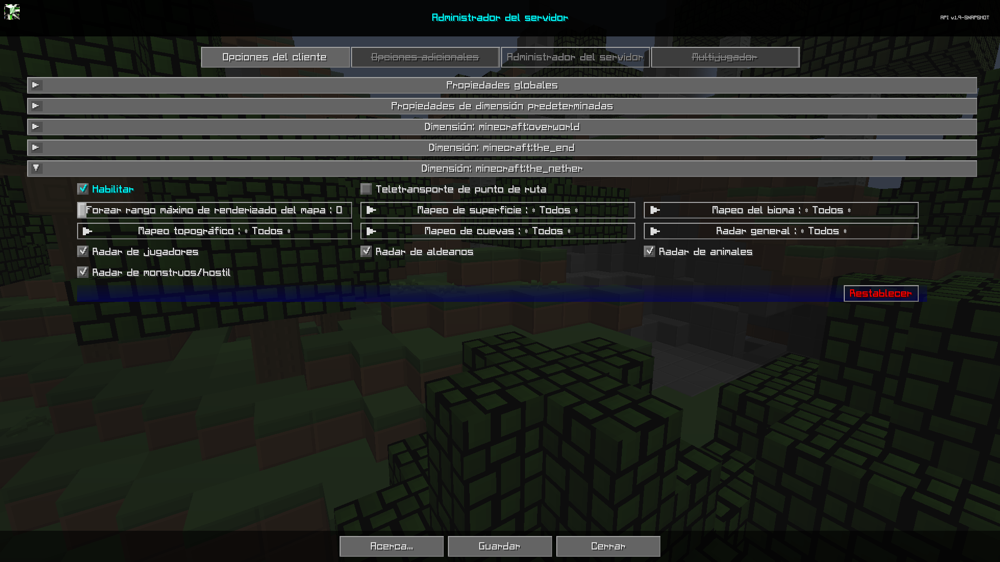

# **Dimensión: minecraft:the_nether**

La categoría Dimensión: minecraft:the_nether contiene configuraciones que serán las configuraciones predeterminadas para la dimensión del nether.

{: .center}

## **Alternar**

| Alternar | Descripción |
|----------------------|------------------------- -------------------------------------------------- ---------------|
| Habilitar | Al habilitar esta dimensión se anularán las propiedades globales de esta dimensión. |
| Teletransporte de punto de ruta | Permite o impide el teletransporte mediante el administrador de puntos de ruta y el menú contextual de pantalla completa |
| Radar de jugadores | Si los jugadores pueden ver a otros jugadores en el mapa. |
| Radar de aldeanos | Si los jugadores pueden ver a los aldeanos en el mapa. |
| Radar de animales | Si los jugadores pueden ver animales en el mapa. |
| Radar de monstruos/hostil | Si los jugadores pueden ver monstruos o entidades hostiles en el mapa. |

## **Otras Configuraciones**

La opción predeterminada para cada configuración a continuación está marcada con texto **negrita**.

| Configuración | Opciones | Descripción |
|----------------------------|-------------------- -------------------------------|------------------ -------------------------------------------------- -------------------------------------------------- ------------------------------------|
| Forzar rango máximo de renderizado del mapa | <ul><li>Rango: 0 - 32 **El valor predeterminado es 0**</li></ul> | Obliga a todos los jugadores a una distancia máxima de renderizado de fragmentos del mapa. |
| Mapeo de superficies | <ul><li>**Todos**</li><li>Op</li><li>Ninguno</li></ul> | Mapeo de superficies para todos, op, ninguno |
| Mapeo de biomas | <ul><li>**Todos**</li><li>Op</li><li>Ninguno</li></ul> | Mapeo de biomas para todos, op, ninguno. |
| Mapeo topográfico | <ul><li>**Todos**</li><li>Op</li><li>Ninguno</li></ul> | Mapeo topográfico para todos, op, ninguno. |
| Mapeo de cuevas | <ul><li>**Todos**</li><li>Op</li><li>Ninguno</li></ul> | Mapeo de cuevas para todos, op, ninguno. |
| Radar general | <ul><li>**Todos**</li><li>Op</li><li>Ninguno</li></ul> | <ul><li>Todos: el radar funciona para todos</li><li>Op: deshabilita completamente el radar para todos excepto para los usuarios OP</li><li>Ninguno: el radar está deshabilitado para todos.</li></ul> |