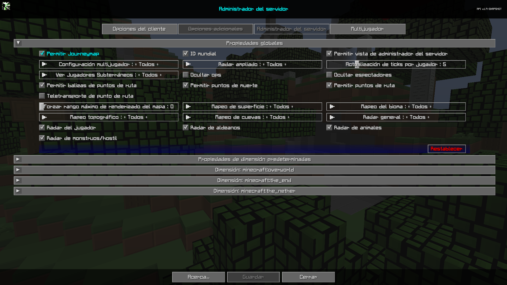

# **Propiedades Globales**

La categoría Propiedades globales contiene configuraciones que afectan el comportamiento del lado del servidor del mod. Estos son los predeterminados
propiedades para el servidor.

{: .center}

## **Alternar**

| Alternar | Descripción |
|---------------------------------|----------------------- -------------------------------------------------- -------------------------------------------------- -------------------------------------------------- -------------------------------------------------- -------------------------------------------------- -------------------------------------------------- -------------------------------------------------- ----------------------|
| Permitir JourneyMap | Si se debe permitir que Journeymap funcione para personas que no son op. |
| ID mundial | Al habilitarlo se cambiará el directorio de guardado para los datos de mapeo de este servidor. Si está deshabilitado y luego habilitado en un servidor activo se restablecerán todos los datos de mapeo del usuario. El uso principal es evitar que se sobrescriban mapas y configuraciones cuando se utiliza una configuración multimundo y cuando los usuarios no dan nombres únicos a los servidores. Si se deshabilita y luego se habilita en un servidor activo, restablecerá todos los datos de mapeo del usuario. |
| Permitir vista de administrador del servidor | Si los usuarios no op pueden ver la pantalla de administración del servidor en modo de solo lectura. |
| Ocultar ops | Ocultar ops en el radar cuando el radar expandido esté habilitado. |
| Permitir puntos de muerte | Si se permite la creación de Puntos de muerte del usuario. |
| Permitir balizas de punto de ruta | Si se permite la representación de balizas en el juego. (no desactiva los puntos de ruta del mapa) |
| Permitir puntos de ruta | Permitir puntos de ruta, deshabilita completamente la representación de mapas y balizas en el juego y las pantallas asociadas. |
| Ocultar espectadores | Ocultar a los espectadores en el radar. |
| Teletransporte de punto de ruta | Permite o impide el teletransporte mediante el administrador de puntos de ruta y el menú contextual de pantalla completa |
| Radar de jugadores | Si los jugadores pueden ver a otros jugadores en el mapa.                                                                                                                                                                                                                                                                                                                                                              |
| Radar de aldeanos | Si los jugadores pueden ver a los aldeanos en el mapa.                                                                                                                                                                                                                                                                                                                                                                  |
| Radar de animales | Si los jugadores pueden ver animales en el mapa.                                                                                                                                                                                                                                                                                                                                                                    |
| Radar de monstruos/hostil (mobs) | Si los jugadores pueden ver monstruos o entidades hostiles en el mapa.                                                                                                                                                                                                                                                                                                                                               |

## **Otras Configuraciones**

La opción predeterminada para cada configuración a continuación está marcada con texto **negrita**.

| Configuración | Opciones | Descripción |
|----------------------------|-------------------- -------------------------------|------------------ -------------------------------------------------- -------------------------------------------------- ------------------------------------|
| Radar ampliado | <ul><li>**Todos**</li><li>Op</li><li>Ninguno</li></ul> | Dejemos que los jugadores vean a otros jugadores en el mapa fuera del rango de renderizado, en cualquier lugar de su dimensión actual. |
| Configuración multijugador | <ul><li>**Todos**</li><li>Op</li><li>Ninguno</li></ul> | Permita que todos los jugadores, jugadores op o ningún jugador usen el menú de configuración multijugador. |
| Actualización de ticks por jugador | <ul><li>Rango: 1 - 20 **El valor predeterminado es 5**</li></ul> | Con qué frecuencia el servidor enviará actualizaciones de la ubicación del jugador. |
| Ver jugadores subterraneos | <ul><li>**Todos**</li><li>Op</li><li>Ninguno</li></ul> | Si los jugadores subterraneos son visibles en el radar. |
| Forzar rango maximo de renderizado del mapa | <ul><li>Rango: 0 - 32 **El valor predeterminado es 0**</li></ul> | Obliga a todos los jugadores a una distancia máxima de renderizado de fragmentos del mapa. |
| Mapeo de superficie | <ul><li>**Todos**</li><li>Op</li><li>Ninguno</li></ul> | Mapeo de superficies para todos, op, ninguno |
| Mapeo del bioma | <ul><li>**Todos**</li><li>Op</li><li>Ninguno</li></ul> | Mapeo de biomas para todos, op, ninguno. |
| Mapeo topográfico | <ul><li>**Todos**</li><li>Op</li><li>Ninguno</li></ul> | Mapeo topográfico para todos, op, ninguno. |
| Mapeo de cuevas | <ul><li>**Todos**</li><li>Op</li><li>Ninguno</li></ul> | Mapeo de cuevas para todos, op, ninguno. |
| Radar general | <ul><li>**Todos**</li><li>Op</li><li>Ninguno</li></ul> | <ul><li>Todos: el radar funciona para todos</li><li>Op: deshabilita completamente el radar para todos excepto para los usuarios OP</li><li>Ninguno: el radar está deshabilitado para todos.</li></ul> |
