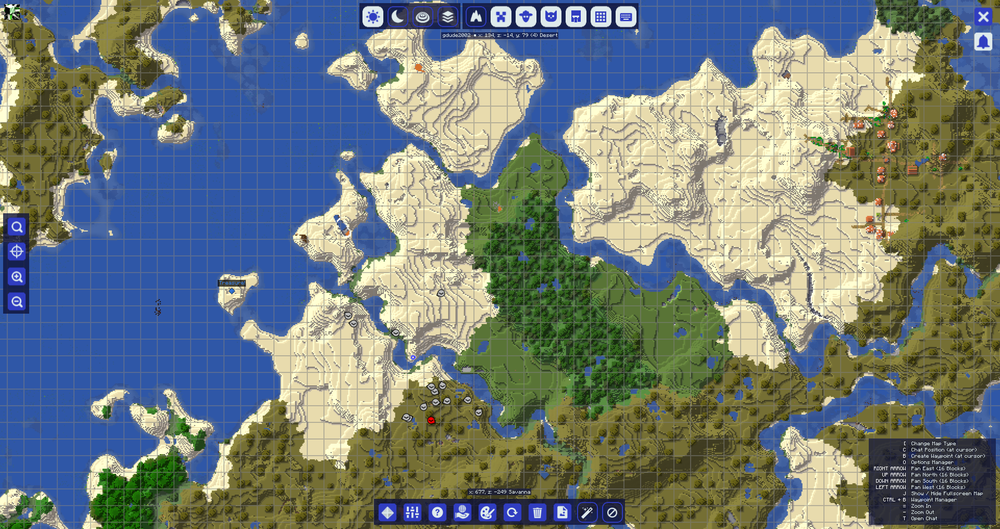

## **Utilisation de Base**

Une fois que vous avez [installé](installing.md) JourneyMap, tout ce que vous avez à faire est de rejoindre un serveur ou de charger un monde en solo.

Pour la plupart, JourneyMap fonctionne directement après l'installation. Tout ce que vous avez à faire pour commencer à cartographier votre monde est de commencer à l'explorer ! La zone autour de vous sera cartographiée automatiquement au fur et à mesure de vos déplacements, et sera visible dans chacun des trois types de cartes que JourneyMap prend en charge.

## **Mappages de Touches**

Les mappages de touches suivants sont disponibles par défaut lorsque vous jouez dans un monde ou sur un serveur multijoueur.

- ++j++ - Afficher/masquer la carte en plein écran
- ++ctrl+j++ - Afficher/masquer la minicarte
- ++equal+minus++ - Zoomer et dézoomer respectivement sur la minicarte
- ++bracket-left++ - Faire défiler le type de carte affiché sur la minicarte
- ++bar++ - Basculer entre les préréglages de la minicarte
- ++b++ - Créer [un point de repère](waypoints.md) là où vous vous tenez actuellement
- ++ctrl+b++ - Ouvrir le [gestionnaire de points de repère](waypoints.md) (cela entre en conflit avec le raccourci du narrateur, vous voudrez peut-être changer ou désactiver cela)
- ++z++ - Basculer la visibilité de tous les points de repère

Toutes les touches spécifiées dans la documentation peuvent être personnalisées dans les paramètres de Minecraft. Il suffit d'ouvrir le menu (par défaut, avec la touche ++esc++), cliquez sur Options puis sur Contrôles, et vous verrez deux nouvelles catégories pour toutes les touches de JourneyMap.

## **Marqueurs**

Tous les types de cartes contiennent des marqueurs. Ces marqueurs dénotent diverses pièces d'informations - telles que la position d'une entité ou [un point de repère](waypoints.md) sur la carte.

| Icône                                                          | Description                                                                       |
|----------------------------------------------------------------|-----------------------------------------------------------------------------------|
| {: .center} | Votre position sur la carte. *Note : Cette icône a  une bordure blanche en jeu.* |
| {: .center}    | [Un point de repère](waypoints.md). La couleur peut être définie  dans le gestionnaire de points de repère. |
| {: .center} | [Un point de repère de mort](waypoints.md)                                        |

| Icône                                                                  | Description                                                                                        |
|------------------------------------------------------------------------|----------------------------------------------------------------------------------------------------|
| {: .center}          | Un marqueur dénotant une entité sur la carte. La couleur  du marqueur dénote le type d'entité. |
| {: .center} | Une entité en dessous de vous.                                                                     |
| {: .center}  | Une entité au-dessus de vous.                                                                      |

| Icône                                                        | Description                          |
|--------------------------------------------------------------|--------------------------------------|
| {: .center}  | Une entité neutre, comme un animal.  |
| {: .center} | Un villageois.                        |
| {: .center}  | Un autre joueur.                      |
| {: .center}  | Une entité hostile, comme un monstre. |

Les marqueurs et leur affichage peuvent être personnalisés dans le [gestionnaire de paramètres](settings/minimap.md).

## **La Minicarte**

Par défaut, la minicarte sera affichée dans le coin supérieur droit de votre écran.

{: .center}

Ceci est votre minicarte. Par défaut, elle affiche la zone autour de votre personnage, ainsi que des informations de base et les positions de votre personnage, d'autres joueurs, d'animaux et de monstres.

La minicarte peut être zoomée et dézoomée à tout moment en appuyant sur l'une des touches de zoom (par défaut, les touches ++equal++ et ++minus++).

Les quatre lignes de texte au-dessus et en dessous de la minicarte sont appelées emplacements d'informations. Par défaut, ils montrent (dans l'ordre) :

- L'heure actuelle dans le monde réel
- L'heure actuelle dans le jeu
- La coordonnée de votre personnage
- Le biome actuel dans lequel se trouve votre personnage

La minicarte et ses emplacements d'informations peuvent être personnalisés dans le [gestionnaire de paramètres](settings/minimap.md).

## **La Carte en Plein Écran**

En appuyant sur la touche de la carte en plein écran (par défaut, la touche J), vous pouvez ouvrir la carte en plein écran.

{: .center}

Cette carte vous donne une vue défilable de toutes les zones de la carte que vous avez explorées jusqu'à présent, affichées telles qu'elles étaient lorsque vous les avez découvertes. Elle donne également accès aux paramètres de JourneyMap et à un certain nombre d'options d'affichage de la carte.

Pour plus d'informations sur la carte en plein écran, veuillez consulter [la page de la carte en plein écran](settings/full-screen-map.md).

## **La Webmap**

Une fois activée dans le [gestionnaire de paramètres](settings/webmap.md), la webmap vous permet de visualiser et d'explorer votre carte générée dans un navigateur web, y compris l'accès depuis un autre appareil (tel qu'un téléphone ou une tablette). Cela fonctionnera tant que le jeu est en cours d'exécution.

{: .center}

Pour plus d'informations sur la webmap, veuillez consulter [la page de la webmap](settings/webmap.md).