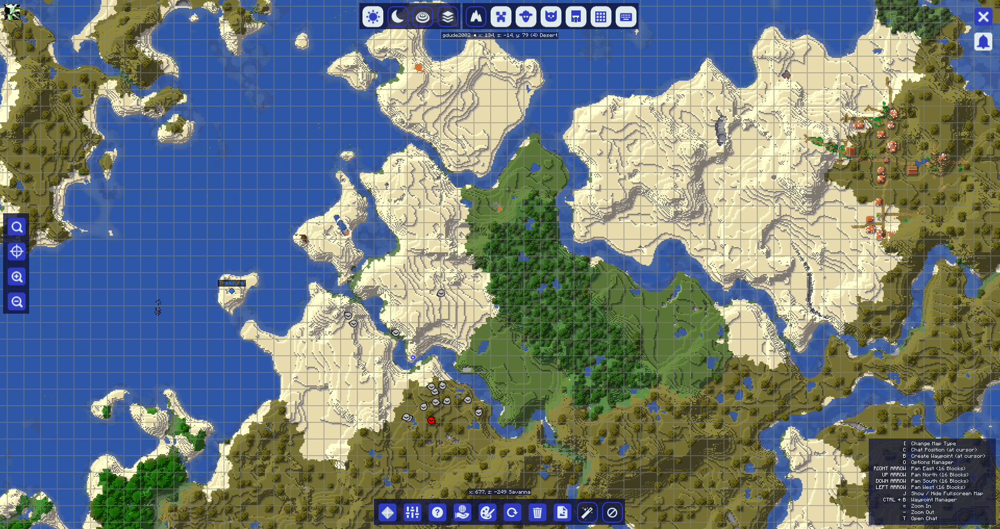

## **Carte en Plein Écran**

En appuyant sur la touche de la carte en plein écran (par défaut, la touche ++j++), vous pouvez ouvrir la carte en plein écran.

{: .center}

La carte en plein écran est une vue défilable et personnalisable de tout ce que vous avez exploré dans votre monde jusqu'à présent. Elle donne accès à une myriade d'options qui seront couvertes ci-dessous, mais vous pouvez également la personnaliser dans les [paramètres de la carte en plein écran](settings/full-screen-map.md).

## **Utilisation Basique**

Une fois que vous avez ouvert la carte en plein écran, vous pouvez faire défiler et zoomer, ou utiliser les boutons autour du bord de l'écran pour changer diverses options et accéder à différentes parties du mod, y compris les paramètres. Voici les commandes de base :

- Cliquez et faites glisser la carte pour vous déplacer
- Utilisez la molette de la souris pour changer le niveau de zoom
- Double-cliquez sur un bloc pour créer un [point de repère](waypoints.md)

Les raccourcis clavier suivants sont disponibles, et ils peuvent être modifiés dans les options de Minecraft :

- ++c++ Copier les coordonnées du bloc sur lequel votre curseur pointe vers la boîte de chat
- ++b++ Créer un [point de repère](waypoints.md) au bloc sur lequel votre curseur pointe
- ++o++ Ouvrir le [gestionnaire de paramètres](settings/overview.md) de JourneyMap

## **Boutons**

Autour du bord de la carte en plein écran se trouve un ensemble de boutons, que vous pouvez utiliser pour personnaliser la vue de la carte en plein écran et accéder à d'autres zones du mod. Les icônes peuvent différer entre les thèmes ; les icônes ci-dessous proviennent des thèmes qui sont fournis avec JourneyMap.

## **Boutons Supérieurs**

| Icône                                          | Description                              |
|------------------------------------------------|------------------------------------------|
| {: .center}       | Passer la carte en mode jour.            |
| {: .center}     | Passer la carte en mode nuit.            |
| {: .center}      | Passer la carte en mode topographique.   |
| {: .center}  | Passer la carte en mode grotte.          |
| {: .center} | Basculer entre les couches en mode grotte. |

| Icône                                                | Description                         |
|------------------------------------------------------|-------------------------------------|
| {: .center}    | Basculer la visibilité des monstres. |
| {: .center}      | Basculer la visibilité des animaux.  |
| {: .center} | Basculer la visibilité des animaux domestiques. |
| {: .center} | Basculer la visibilité des villageois. |
| {: .center}      | Basculer la visibilité des autres joueurs. |

| Icône                                      | Description                                                                                                  |
|--------------------------------------------|--------------------------------------------------------------------------------------------------------------|
| {: .center} | Basculer la visibilité de la grille. Maintenez ++shift++ et  cliquez pour changer les [paramètres de grille](settings/grid.md). |
| {: .center} | Basculer la visibilité des raccourcis clavier.                                                               |

## **Boutons en Haut à Droite**

| Icône                                        | Description                           |
|----------------------------------------------|---------------------------------------|
| {: .center} | Fermer la carte en plein écran.       |
| {: .center} | Obtenir la dernière version de JourneyMap. |

## **Boutons Gauches**

| Icône                                             | Description                       |
|---------------------------------------------------|-----------------------------------|
| {: .center}  | Ouvrir le localisateur de position. |
| {: .center}     | Centrer la carte sur votre personnage. |
| {: .center}    | Zoomer.                           |
| {: .center}  | Dézoomer.                         |

## **Boutons Inférieurs**

| Icône                                                | Description                                        |
|------------------------------------------------------|----------------------------------------------------|
| {: .center} | Ouvrir le [gestionnaire de points de repère](settings/waypoint.md). |
| {: .center}      | Ouvrir le [gestionnaire de paramètres](settings/overview.md). |
| {: .center}       | Ouvrir l'écran À propos.                            |
| {: .center}  | Ouvrir la [Webmap](../settings/webmap.md), si activée.                       |
| {: .center}          | Passer à travers les thèmes disponibles.           |
| {: .center}  | Réinitialiser la palette de couleurs.              |
| {: .center}     | Supprimer la carte dans une ou plusieurs dimensions. |
| {: .center}  | Sauvegarder toute la carte dans un fichier.        |
| {: .center}   | Cartographier le monde exploré, en solo.           |
| {: .center}   | Basculer la cartographie on et off.                |