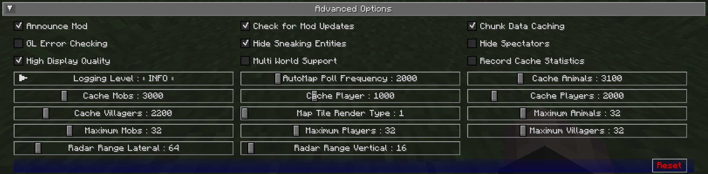

## **Paramètres Avancés**

Cette section contient des paramètres avancés pour les utilisateurs expérimentés et ceux qui souhaiteraient peaufiner certains aspects internes de JourneyMap.

!!! warning "Avertissement"

    Les paramètres de cette section peuvent avoir des effets extrêmes sur la performance de votre client. Nous ne recommandons pas de toucher à ces paramètres à moins que vous n'ayez une bonne compréhension de ce que vous faites, ou que vous soyez dirigé pour le faire par un membre du personnel de support de JourneyMap.

    Si la modification de ces paramètres fait planter votre client ou cause un lag horrible de votre ordinateur, ne dites pas que nous ne vous avons pas prévenu.

{: .center}

## **Bascules**

Les paramètres de bascule **en gras** ci-dessous sont activés par défaut.

| Bascule                     | Description                                                                                                                                             |
|-----------------------------|---------------------------------------------------------------------------------------------------------------------------------------------------------|
| **Annoncer le Mod**           | Si oui ou non annoncer dans le chat quand JourneyMap est prêt à l'emploi                                                                                             |
| **Vérifier les Mises à Jour du Mod**  | Si JourneyMap doit vérifier les mises à jour sur Curse                                                                                                    |
| **Caching des Données de Chunk**     | Active ou désactive le caching des chunks                                                                                                                       |
| Vérification d'Erreurs GL          | Active ou désactive la vérification d'erreurs OpenGL                                                                                                               |
| **Masquer les Entités en Furtivité** | Si les créatures en mode furtif doivent être cachées                                                                                                   |
| Masquer les Spectateurs            | Si les spectateurs doivent être cachés sur le radar                                                                                                        |
| **Haute Qualité d'Affichage**   | Décochez pour améliorer la performance de zoom et l'utilisation de mémoire, mais réduire  la qualité d'affichage et la performance de rotation de la minicarte quand réglé sur “Ma Direction” |
| Support Multi-Monde        | Active ou désactive le support multi-monde - Note : cela peut ne pas fonctionner pour tous les serveurs.                                                                      |
| Enregistrer les Statistiques de Cache    | Destiné aux testeurs bêta - activer pour enregistrer les statistiques pour chaque cache                                                                          |

## **Autres Paramètres**

L'option par défaut pour chaque paramètre ci-dessous est marquée en **gras**.

| Paramètre                | Options                                                                                                                 | Description                                                                                                                                                                                                 |
|--------------------------|-------------------------------------------------------------------------------------------------------------------------|-------------------------------------------------------------------------------------------------------------------------------------------------------------------------------------------------------------|
| Niveau de Log          | <ul><li>**INFO**</li><li>ALL</li><li>DEBUG</li><li>ERREUR</li><li>FATAL</li><li>OFF</li><li>TRACE</li><li>AVERTISSEMENT</li></ul> | Définissez la verbosité des logs de JourneyMap, mais notez que certains niveaux de log peuvent causer de sérieux problèmes de performance                                                                                                 |
| Fréquence de Sondage AutoMap | Plage : 500 - 10000 (en ms)  Par défaut **2000**                                                                      | Délai entre les tâches de région automap - des valeurs plus basses feront générer la carte plus rapidement, mais causeront des baisses de performance significatives pendant la cartographie                                                             |
| Cacher les Animaux          | Plage : 1000 - 10000 (en ms)  Par défaut **3100**                                                                     | Combien de temps les données radar pour les animaux sont mises en cache - des valeurs plus basses impacteront la performance                                                                                                                        |
| Cacher les Mobs             | Plage : 1000 - 10000 (en ms)  Par défaut **3000**                                                                     | Combien de temps les données radar pour les mobs sont mises en cache - des valeurs plus basses impacteront la performance                                                                                                                           |
| Cacher le Joueur           | Plage : 500 - 2000 (en ms)  Par défaut **1000**                                                                       | Combien de temps les données pour votre personnage sont mises en cache - des valeurs plus basses impacteront la performance                                                                                                                       |
| Cacher les Joueurs          | Plage : 1000 - 10000 (en ms)  Par défaut **2000**                                                                     | Combien de temps les données radar pour les autres joueurs sont mises en cache - des valeurs plus basses impacteront la performance                                                                                                                  |
| Type de Rendu des Tuiles de Carte   | Plage : 1 - 4  Par défaut **1**                                                                                       | Changez la stratégie de rendu pour les tuiles de carte si elles apparaissent floues sur votre carte vidéo:<ol type="1"><li>Linéaire & miroir</li><li>Linéaire & clampé</li><li>Le plus proche & miroir</li><li>Le plus proche & clampé</li></ol> |
| Maximum d'Animaux        | Plage : 1 - 128  Par défaut **32**                                                                                    | Nombre maximum d'animaux affichés sur le radar                                                                                                                                                            |
| Maximum de Mobs           | Plage : 1 - 128  Par défaut **32**                                                                                    | Nombre maximum de mobs affichés sur le radar                                                                                                                                                               |
| Maximum de Joueurs        | Plage : 1 - 128  Par défaut **32**                                                                                    | Nombre maximum de joueurs affichés sur le radar                                                                                                                                                            |
| Maximum de Villageois      | Plage : 1 - 128  Par défaut **32**                                                                                    | Nombre maximum de villageois affichés sur le radar                                                                                                                                                          |
| Portée Radar Latérale    | Plage : 16 - 512 (en blocs)  Par défaut **64**                                                                       | Distance latérale pour chercher des entités à afficher sur le radar - des valeurs élevées causeront un impact significatif sur la performance                                                                                      |
| Portée Radar Verticale   | Plage : 8 - 256 (en blocs)  Par défaut **16**                                                                        | Distance verticale pour chercher des entités à afficher sur le radar - des valeurs élevées causeront un impact significatif sur la performance                                                                                     |