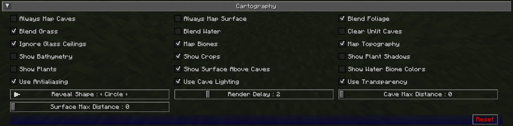

## **Paramètres de Cartographie**

Les paramètres de cartographie vous permettent de personnaliser la façon dont la carte est rendue et ce qui est affiché dessus.

{: .center}

## **Bascules**

Les paramètres de bascule **en gras** ci-dessous sont activés par défaut.

| Bascule                       | Description                                                                                                     |
|-------------------------------|-----------------------------------------------------------------------------------------------------------------|
| Cartographier Toujours les Grottes | Que les grottes sous vous soient cartographiées lorsque vous êtes à la surface                                  |
| Cartographier Toujours la Surface  | Que la surface au-dessus de vous soit cartographiée lorsque vous êtes dans des grottes                          |
| **Mélanger le Feuillage**        | Que les couleurs des biomes soient appliquées au feuillage                                                       |
| **Mélanger l'Herbe**             | Que les couleurs des biomes soient appliquées à l'herbe                                                          |
| Mélanger l'Eau                   | Que les couleurs des biomes soient appliquées à l'eau                                                            |
| Effacer les Grottes Non Éclairées | Les blocs non éclairés et de tranche intérieure sont rendus transparents au lieu de noirs. Cette option affecte seulement les blocs nouvellement cartographiés. |
| **Ignorer les Plafonds en Verre** | Rester en mode surface même sous un plafond en verre                                                             |
| **Cartographier les Biomes**     | Montrer les couleurs des biomes sur la carte                                                                     |
| **Cartographier la Topographie** | Générer une carte de contour montrant l'élévation                                                                |
| Montrer la Bathymétrie            | Montrer le terrain sous-marin sur la carte                                                                       |
| **Montrer les Cultures**         | Montrer les cultures sur la carte                                                                                |
| Montrer les Ombres des Plantes    | Que les plantes et cultures projettent des ombres sur la carte                                                   |
| Montrer les Plantes               | Montrer les plantes sur la carte                                                                                 |
| **Montrer la Surface au-dessus des Grottes** | Montrer une vue atténuée de la surface en mode grotte                                                            |
| Montrer les Couleurs de l'Eau des Biomes | Montrer les couleurs de l'eau basées sur les biomes                                                              |
| **Utiliser l'Anticrénelage**      | Utiliser l'anticrénelage pour améliorer l'effet d'ombrage utilisé pour montrer l'élévation                        |
| **Utiliser l'Éclairage des Grottes** | Montrer les lumières souterraines - désactiver pour une carte entièrement éclairée                                |
| **Utiliser la Transparence**      | Que les blocs transparents révèlent ce qui est en dessous sur la carte                                            |

## **Autres Paramètres**

L'option par défaut pour chaque paramètre ci-dessous est marquée en **gras**.

| Paramètre              | Options                                      | Description                                                                                                                                                                          |
|------------------------|----------------------------------------------|--------------------------------------------------------------------------------------------------------------------------------------------------------------------------------------|
| Forme de Révélation    | <ul><li>Carré</li><li>**Cercle**</li></ul>   | Que révéler les chunks dans un cercle ou un carré - les révélations en cercle montrent moins de chunks à la fois, et donc, offrent de meilleures performances                         |
| Délai de Rendu         | Plage : 0 - 10 (en secondes, Par défaut : **2**) | À quelle fréquence JourneyMap devrait essayer de rendre les chunks autour de vous - Des valeurs plus élevées peuvent entraîner une meilleure performance, mais peuvent manquer des chunks en se déplaçant à grande vitesse |
| Distance Max des Grottes  | Plage : 0 - 32 (en chunks, Par défaut : **0**) | La distance maximale à laquelle essayer de rendre la carte en étant dans une grotte - si vous réglez cela plus haut que votre distance de rendu, cela utilisera cela à la place                                |
| Distance Max de la Surface | Plage : 0 - 32 (en chunks, par défaut : **0**) | La distance maximale à laquelle essayer de rendre la carte en étant au-dessus du sol - si vous réglez cela plus haut que votre distance de rendu, cela utilisera cela à la place                              |