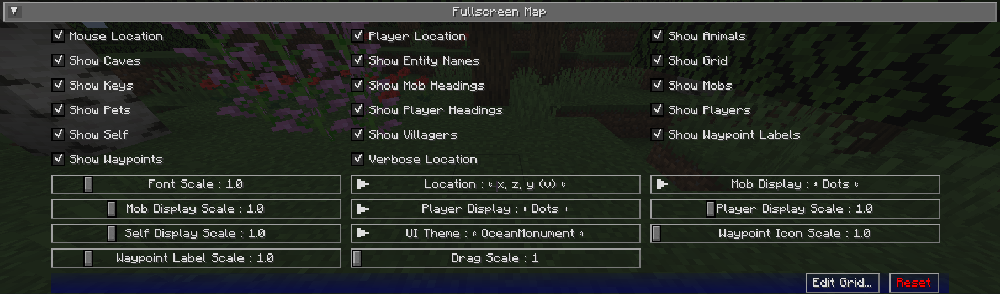

## **Paramètres de la Carte en Plein Écran**

La carte en plein écran fournit une vue large et défilable de l'ensemble de votre carte. Tout comme les préréglages de la minicarte, elle peut être
personnalisée dans une large mesure.

Pour ouvrir la carte en plein écran, appuyez sur la touche de la carte en plein écran (la touche ++j++ par défaut).

{: .center}

!!! note "Note"

    Un certain nombre des options suivantes sont également disponibles sous forme de boutons sur la vue de la carte en plein écran elle-même. Pour plus d'informations à ce sujet, veuillez consulter [la page de la carte en plein écran](../full-screen-map.md).

## **Bascules**

Par défaut, tous les paramètres de bascule suivants sont activés.

| Bascule               | Description                                                             |
|-----------------------|-------------------------------------------------------------------------|
| Position de la Souris | Afficher la position du bloc pointé par la souris au-dessus des boutons |
| Position du Joueur    | Afficher la position du joueur en dessous des boutons supérieurs        |
| Montrer les Animaux   | Afficher ou cacher les animaux sur la carte                             |
| Montrer les Grottes   | Basculer automatiquement en mode grotte quand sous terre ou à l'intérieur |
| Montrer les Noms des Entités | Afficher ou cacher les noms des entités sur la carte                   |
| Montrer la Grille     | Afficher ou cacher la grille sur la carte                               |
| Montrer les Touches   | Afficher ou cacher les raccourcis clavier et leurs descriptions sur la carte |
| Montrer les Directions des Mobs | Basculer l'affichage de la direction des mobs sur la carte              |
| Montrer les Mobs      | Afficher ou cacher les mobs sur la carte                                |
| Montrer les Animaux Domestiques | Afficher ou cacher les animaux domestiques sur la carte               |
| Montrer les Directions des Joueurs | Basculer l'affichage de la direction des autres joueurs sur la carte    |
| Montrer les Joueurs   | Afficher ou cacher les autres joueurs sur la carte                      |
| Montrer Soi-même      | Afficher ou cacher votre propre position et direction sur la carte      |
| Montrer les Villageois | Afficher ou cacher les villageois sur la carte                         |
| Montrer les Étiquettes des Points de Repère | Afficher ou cacher les noms des points de repère sur la carte          |
| Montrer les Points de Repère | Afficher ou cacher tous les points de repère sur la carte              |
| Position Verbeuse     | Basculer entre une forme longue ou courte de vos coordonnées actuelles  |

## **Autres Paramètres**

L'option par défaut pour chaque paramètre ci-dessous est marquée en **gras**.

| Paramètre              | Options                                                                                                                                                  | Description                                                                                                                                                    |
|------------------------|----------------------------------------------------------------------------------------------------------------------------------------------------------|----------------------------------------------------------------------------------------------------------------------------------------------------------------|
| Échelle de Police      | <ul><li>Plage : 0.5 - 5 **Par défaut 1**</li></ul>                                                                                                       | L'échelle de police pour les étiquettes et le texte                                                                                                            |
| Position               | <ul><li>**x, z, y (v)**</li><li>x, y, (v), z</li><li>x, z, y</li><li>x, y, z</li><li>x, z</li></ul>                                                      | Le format de vos coordonnées, tel qu'affiché sur la carte.                                                                                                     |
| Affichage des Mobs     | <ul><li>**Points**</li><li>Icônes</li></ul>                                                                                                              | Comment les mobs doivent être affichés sur la carte.                                                                                                           |
| Échelle d'Affichage des Mobs | <ul><li>Plage : 0.01 - 5  **Par défaut 1**</li></ul>                                                                                                 | L'échelle des icônes et points des mobs sur la carte.                                                                                                          |
| Affichage des Joueurs  | <ul><li>**Points**</li><li>Icônes</li></ul>                                                                                                              | Comment les autres joueurs doivent être affichés sur la carte.                                                                                                 |
| Échelle d'Affichage des Joueurs | <ul><li>Plage : 0.01 - 5  **Par défaut 1**</li></ul>                                                                                                 | L'échelle des icônes et points des joueurs sur la carte.                                                                                                       |
| Échelle d'Affichage de Soi | <ul><li>Plage : 0.01 - 5  **Par défaut 1**</li></ul>                                                                                                 | L'échelle de votre propre icône sur la carte.                                                                                                                  |
| Thème UI               | <ul><li>**OceanMonument**</li><li>Desert Temple</li><li>EndCity</li><li>ForestMansion</li><li>NetherFortress</li><li>Purist</li><li>Stronghold</li></ul> | Changez le thème des boutons autour de la carte en plein écran - **Note** : Si vous avez des thèmes supplémentaires installés, il y aura plus d'options que celles présentées ici |
| Échelle des Icônes des Points de Repère | <ul><li>Plage : 1 - 5  **Par défaut 1**</li></ul>                                                                                                    | L'échelle des icônes des points de repère sur la carte.                                                                                                       |
| Échelle des Étiquettes des Points de Repère | <ul><li>Plage : 0.5 - 5  **Par défaut 1**</li></ul>                                                                                                  | L'échelle de police pour les étiquettes des points de repère sur la carte.                                                                                    |
| Échelle de Glissement  | <ul><li>Plage : 1 - 5  **Par défaut 1**</li></ul>                                                                                                    | Échelle de glissement personnalisée, un nombre plus élevé la ralentit. Utile lorsque votre OS effectue une mise à l'échelle de l'affichage, principalement les écrans retina OSX.             |