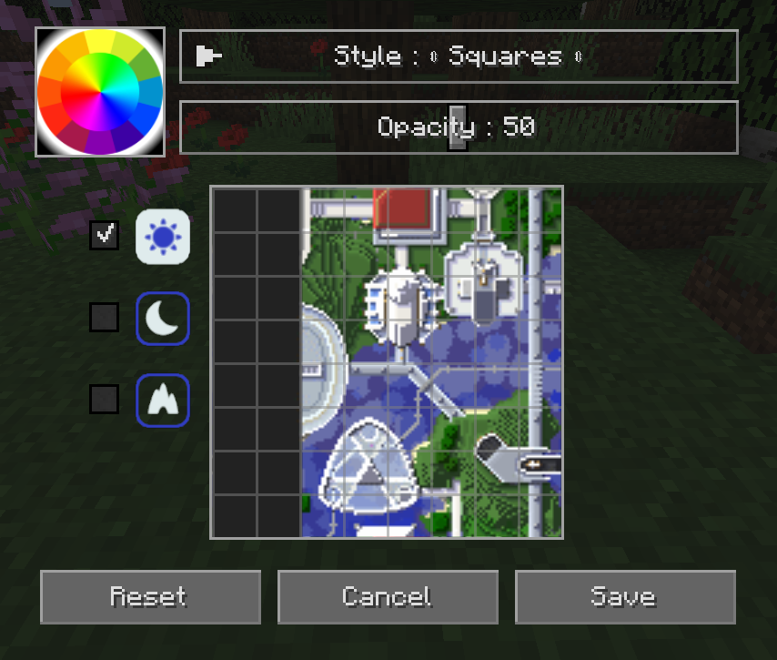

## **Paramètres de la Grille**

Tant les préréglages de la minicarte que la carte en plein écran peuvent avoir une superposition de grille configurable. Vous pouvez personnaliser cette superposition en cliquant sur le bouton **Modifier la Grille...** sous les paramètres dans chaque catégorie respective.

Vous pouvez également accéder à cela depuis la carte en plein écran en maintenant la touche ++shift++ et en cliquant sur le bouton de grille en haut.

{: .center}

La grille délimite les chunks individuels sur la carte. Les styles de grille qui incluent des lignes de région dessineront une grille supplémentaire avec des lignes de couleurs différentes pour délimiter les régions du monde sur la carte.

- Sélectionnez une couleur pour les lignes de la grille en cliquant sur la roue des couleurs.
- Sélectionnez le type de carte (jour, nuit ou grottes) à éditer sur le côté gauche.
- Cliquez sur le bouton **Réinitialiser** pour réinitialiser le type de carte actuel aux paramètres de grille par défaut.
- Cliquez sur le bouton **Annuler** pour ignorer vos modifications et fermer l'éditeur de grille.
- Cliquez sur le bouton **Sauvegarder** pour enregistrer vos modifications et fermer l'éditeur de grille.

| Paramètre | Options                                                     | Description                                        |
|-----------|-------------------------------------------------------------|----------------------------------------------------|
| Style     | **Carrés**, CarrésAvecRégion, GrilleRégion, Points, Damiers | Change le type de grille superposée sur la carte   |
| Opacité   | Pourcentage : 0 - 100  **Par défaut 50**                 | À quel point la grille doit être dessinée de manière opaque |