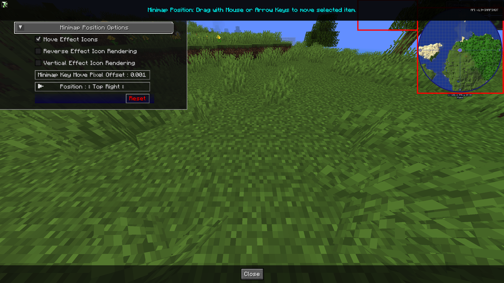

## **Paramètres de Position de la Minicarte**

JourneyMap vous permet de configurer l'emplacement à la fois des icônes d'effets et de la minicarte elle-même. Cela vous permet, en tant qu'utilisateur, de déplacer la minicarte et les icônes d'effets où vous voulez sur l'écran.

{: .center}

## **Bascules**

Les paramètres de bascule **en gras** ci-dessous sont activés par défaut.

| Bascule                           | Description                                                                    |
|-----------------------------------|--------------------------------------------------------------------------------|
| **Déplacer les Icônes d'Effets**  | Permet de déplacer les effets de potion loin de la minicarte.                  |
| Inversion du Rendu des Icônes d'Effets | Rendu inversé des icônes. Vertical du bas vers le haut, horizontal de gauche à droite |
| Rendu Vertical des Icônes d'Effets | Rendu vertical des icônes en premier, de haut en bas.                          |

## **Autres Paramètres**

L'option par défaut pour chaque paramètre ci-dessous est marquée en **gras**.

| Paramètre                         | Options                                                                                                                                    | Description                                                                                                                |
|-----------------------------------|--------------------------------------------------------------------------------------------------------------------------------------------|----------------------------------------------------------------------------------------------------------------------------|
| Décalage en Pixels du Mouvement de la Minicarte | <ul><li>Plage : 0.001 - 0.025  **Par défaut 0.001**</li></ul>                                                                             | Lors du déplacement de la minicarte avec les touches fléchées, cette option contrôle combien de pixels par pression de touche pour aider à ajuster précisément l'emplacement. |
| Position                          | <ul><li>**Haut Droit**</li><li>Bas Droit</li><li>Bas Gauche</li><li>Haut Gauche</li><li>Haut Centre</li><li>Centre</li><li>Personnalisé</li></ul> | Réglez sur **Personnalisé** pour faire glisser la minicarte à l'emplacement souhaité.                                      |