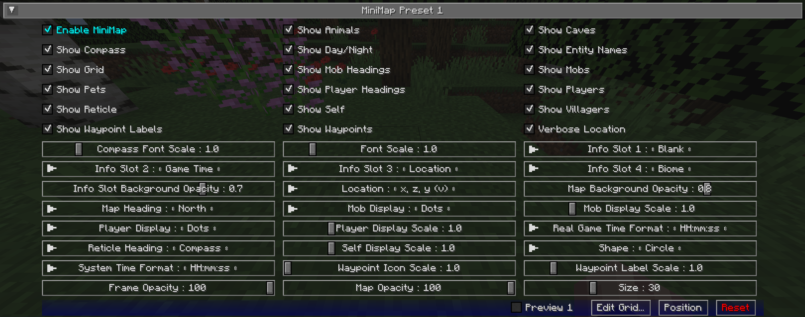
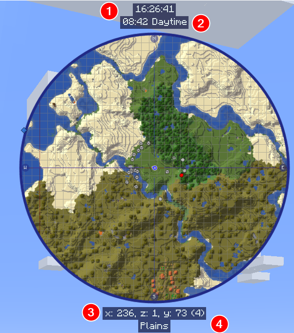

## **Paramètres de la Minicarte**

JourneyMap vous permet d'avoir deux préréglages de minicarte. Chaque préréglage représente un ensemble distinct de paramètres, vous permettant essentiellement d'avoir deux minicartes distinctes entre lesquelles vous pouvez basculer.

!!! note "Note"

    Les paramètres pour chaque minicarte sont identiques, nous ne couvrirons donc qu'un seul préréglage ci-dessous.

Pour basculer entre les préréglages de minicarte, appuyez sur la touche de changement de préréglage de minicarte (la touche ++backslash++ par défaut).

{: .center}

## **Bascules**

Par défaut, tous les paramètres de bascule suivants sont activés.

| Bascule                 | Description                                                                 |
|-------------------------|-----------------------------------------------------------------------------|
| Activer la Minicarte    | Activer ou désactiver ce préréglage de minicarte                            |
| Montrer les Animaux     | Afficher ou cacher les animaux                                              |
| Montrer les Grottes     | Basculer automatiquement en mode grotte                                     |
| Montrer la Boussole     | Basculer l'affichage des points cardinaux autour du bord de la minicarte    |
| Montrer Jour/Nuit       | Basculer automatiquement entre le mode jour et nuit                         |
| Montrer les Noms des Entités | Afficher ou cacher les noms des entités                                     |
| Montrer la Grille       | Afficher ou cacher la superposition de grille                               |
| Montrer les Directions des Mobs | Basculer l'affichage de la direction des mobs                               |
| Montrer les Mobs        | Afficher ou cacher les mobs                                                 |
| Montrer les Animaux Domestiques | Afficher ou cacher les animaux domestiques                                 |
| Montrer les Directions des Joueurs | Basculer l'affichage de la direction des autres joueurs                     |
| Montrer les Joueurs     | Afficher ou cacher les autres joueurs                                       |
| Montrer le Réticule     | Afficher ou cacher les lignes pointant vers le centre de la minicarte       |
| Montrer Soi-même        | Afficher ou cacher votre propre emplacement et direction                    |
| Montrer les Villageois  | Afficher ou cacher les villageois                                           |
| Montrer les Étiquettes des Points de Repère | Afficher ou cacher les noms des points de repère                           |
| Montrer les Points de Repère | Afficher ou cacher tous les points de repère                               |
| Emplacement Verbeux     | Basculer entre une forme longue ou courte de vos coordonnées actuelles      |

## **Emplacements d'Info**

Les emplacements d'info sont des zones de texte au-dessus et en dessous de la minicarte qui affichent des informations contextuelles supplémentaires. Il y en a quatre,
numérotés de haut en bas.

{: .center}

Tous les emplacements d'info peuvent être réglés sur l'un des suivants :

- **Vide** : Rien, masquer cet emplacement d'info
- **Biome** : Le biome dans lequel vous vous trouvez actuellement
- **Dimension** : La dimension dans laquelle vous vous trouvez actuellement
- **FPS** : Le compteur FPS du jeu
- **Temps de Jeu** : L'heure actuelle dans le jeu, telle que représentée par le cycle jour/nuit de Minecraft
- **Temps de Jeu Réel** : L'heure actuelle dans le jeu, ajustée pour correspondre à une horloge réelle
- **Niveau de Lumière** : Le niveau de lumière du bloc sur lequel vous vous tenez
- **Emplacement** : Vos coordonnées actuelles
- **Région** : Vos coordonnées de région actuelles
- **Heure Système** : L'heure réelle actuelle, selon votre ordinateur

## **Autres Paramètres**

L'option par défaut pour chaque paramètre ci-dessous est marquée en **gras**.

| Paramètre                      | Options                                                                                                                                                                                                  | Description                                                                                         |
|--------------------------------|----------------------------------------------------------------------------------------------------------------------------------------------------------------------------------------------------------|-----------------------------------------------------------------------------------------------------|
| Échelle de Police de la Boussole | <ul><li>Plage : 0.5 - 4 **Par défaut 1**</li></ul>                                                                                                                                                       | L'échelle de police utilisée pour les étiquettes des points cardinaux                                |
| Échelle de Police               | <ul><li>Plage : 0.5 - 5 **Par défaut 1**</li></ul>                                                                                                                                                       | L'échelle de police pour les étiquettes et le texte                                                  |
| Opacité du Fond des Emplacements d'Info | <ul><li>Plage : 0 - 1  **Par défaut 0.7**</li></ul>                                                                                                                                                   | Ajuster l'opacité du fond des emplacements d'info.                                                   |
| Emplacement                     | <ul><li>**x, z, y (v)**</li><li>x, y, (v), z</li><li>x, z, y</li><li>x, y, z</li><li>x, z</li></ul>                                                                                                      | Le format de vos coordonnées, tel qu'affiché sur la carte.                                           |
| Opacité du Fond de la Carte      | <ul><li>Plage : 0 - 1  **Par défaut 0.8**</li></ul>                                                                                                                                                   | Ajuster l'opacité du cadre de la MiniCarte (en pourcentage)                                 |
| Orientation de la Carte         | <ul><li>**Nord**</li><li>Nord Ancien</li><li>Ma Direction</li></ul>                                                                                                                                      | L'orientation (rotation) de la MiniCarte. Note : Seule la forme Circulaire supporte "Ma Direction". |
| Affichage des Mobs              | <ul><li>**Points**</li><li>Icônes</li></ul>                                                                                                                                                              | Comment les mobs doivent être affichés sur la carte.                                                 |
| Échelle d'Affichage des Mobs     | <ul><li>Plage : 0.01 - 5  **Par défaut 1**</li></ul>                                                                                                                                                  | L'échelle des icônes et points des mobs sur la carte.                                                |
| Affichage des Joueurs           | <ul><li>**Points**</li><li>Icônes</li></ul>                                                                                                                                                              | Comment les autres joueurs doivent être affichés sur la carte.                                       |
| Échelle d'Affichage des Joueurs  | <ul><li>Plage : 0.01 - 5  **Par défaut 1**</li></ul>                                                                                                                                                  | L'échelle des icônes et points des joueurs sur la carte.                                             |
| Format du Temps de Jeu Réel      | <ul><li>**HH:mm:ss**</li><li>H:mm:ss</li><li>HH:mm</li><li>H:mm</li><li>hh:mm:ss a</li><li>h:mm:ss a</li><li>hh:mm:ss</li><li>h:mm:ss</li><li>h:mm a</li><li>h:mm a</li><li>hh:mm</li><li>h:mm</li></ul>   | Le format de texte du temps de jeu réel, tel qu'affiché dans un emplacement d'info.                   |
| Orientation du Réticule         | <ul><li>**Boussole**</li><li>Ma Direction</li></ul>                                                                                                                                                      | Changer l'orientation du réticule.                                                                   |
| Échelle d'Affichage de Soi       | <ul><li>Plage : 0.01 - 5  **Par défaut 1**</li></ul>                                                                                                                                                  | L'échelle de votre propre icône sur la carte.                                                        |
| Forme                           | <ul><li>**Cercle**</li><li>Carré</li><li>Rectangle</li></ul>                                                                                                                                             | Changer la forme de la minicarte.                                                                   |
| Format de l'Heure Système        | <ul><li>**HH:mm:ss**</li><li>H:mm:ss</li><li>HH:mm</li><li>H:mm</li><li>hh:mm:ss a</li><li>h:mm:ss a</li><li>hh:mm:ss</li><li>h:mm:ss</li><li>h:mm a</li><li>h:mm a</li><li>hh:mm</li><li>h:mm</li></ul>   | Le format de texte de l'heure système, tel qu'affiché dans un emplacement d'info.                    |
| Échelle des Icônes des Points de Repère | <ul><li> Plage : 1 - 5  **Par défaut 1**</li></ul>                                                                                                                                                     | L'échelle des icônes des points de repère sur la carte.                                             |
| Échelle des Étiquettes des Points de Repère | <ul><li>Plage : 0.5 - 5  **Par défaut 1**</li></ul>                                                                                                                                                   | L'échelle de police pour les étiquettes des points de repère sur la carte.                          |
| Opacité du Cadre                | <ul><li>Plage 0 - 100  **Par défaut 100**</li><ul>                                                                                                                                                   | À quel point le cadre autour de la minicarte doit être opaque                                         |
| Opacité de la Carte             | <ul><li>Plage 0 - 100  **Par défaut 100**</li><ul>                                                                                                                                                   | À quel point la vue de la carte elle-même doit être opaque                                           |
| Taille                          | <ul><li>Plage 0 - 100  **Par défaut 30**</li><ul>                                                                                                                                                     | Quelle taille la minicarte doit avoir, en pourcentage de la taille de la fenêtre                     |