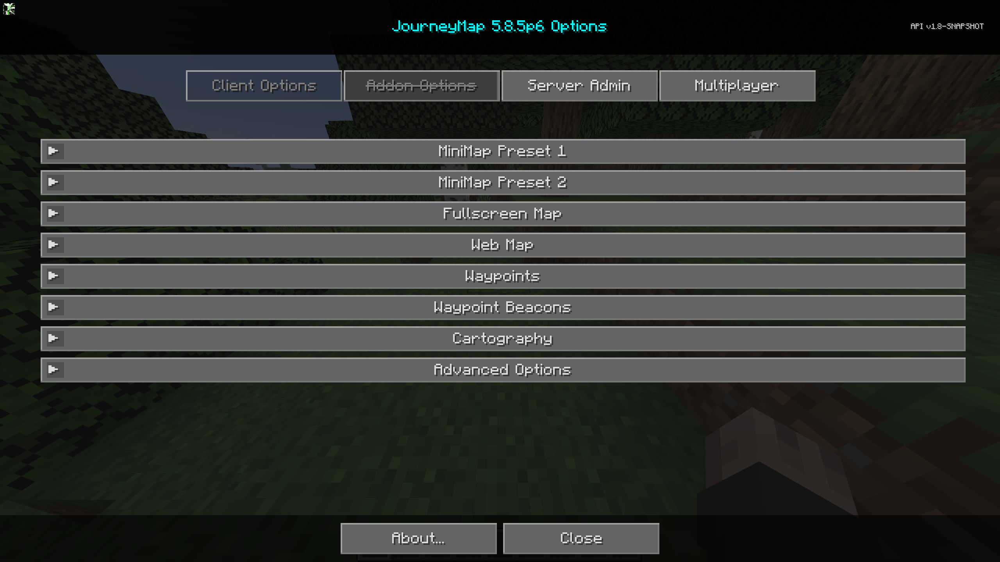

## **Paramètres**

JourneyMap offre de nombreuses options de configuration, vous permettant de personnaliser le comportement et l'apparence de nombreux aspects différents du mod. Tous ces paramètres sont accessibles via le gestionnaire de paramètres.

{: .center}

Pour accéder au gestionnaire de paramètres, ouvrez la carte en plein écran et cliquez sur le bouton des paramètres en bas, ou appuyez sur la touche ++o++. Chaque entrée dans la liste représente une catégorie spécifique de paramètres - cliquez dessus pour l'expandre et voir les paramètres qu'elle contient.

!!! note "Note"

    Chaque catégorie a un bouton Réinitialiser. Veuillez noter qu'appuyer sur ce bouton réinitialisera les paramètres dans cette catégorie aux paramètres par défaut fournis avec JourneyMap, au lieu de simplement ignorer vos modifications.