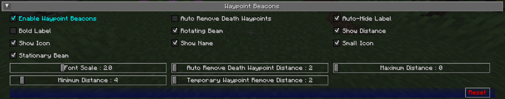

## **Paramètres des Balises de Points de Repère**

Par défaut, les points de repère sont affichés dans le monde à l'aide d'un faisceau de balise au loin, ce qui vous permet de voir où ils se trouvent depuis n'importe où dans le monde. Vous pouvez regarder vers le faisceau et voir également l'icône et l'étiquette du point de repère. Ce comportement peut être personnalisé ci-dessous.

{: .center}

## **Bascules**

Les paramètres de bascule **en gras** ci-dessous sont activés par défaut.

| Bascule                             | Description                                                       |
|-------------------------------------|-------------------------------------------------------------------|
| **Activer les Balises de Points de Repère** | Afficher les balises de jeu de vos points de repère              |
| Suppression Automatique des Points de Repère de Mort | Supprimer automatiquement les points de repère de mort en vous en approchant |
| **Masquer Automatiquement l'Étiquette** | Masquer les étiquettes des points de repère lorsque vous ne les regardez pas |
| Étiquette en Gras                   | Utiliser des étiquettes de points de repère en gras sur les balises |
| **Faisceau Rotatif**                | Utiliser un faisceau externe rotatif pour les balises de points de repère |
| **Afficher la Distance**            | Afficher la distance au point de repère sur son étiquette        |
| **Afficher l'Icône**                | Afficher l'icône d'un point de repère avec sa balise             |
| **Afficher le Nom**                 | Afficher le nom d'un point de repère dans sa balise              |
| **Icône Petite**                    | Utiliser une petite icône pour les balises de points de repère   |
| **Faisceau Stationnaire**           | Utiliser un faisceau interne stationnaire pour les balises de points de repère |

## **Autres Paramètres**

L'option par défaut pour chaque paramètre ci-dessous est marquée en **gras**.

| Paramètre                                 | Options                                                  | Description                                                            |
|-------------------------------------------|----------------------------------------------------------|------------------------------------------------------------------------|
| Échelle de Police                         | <ul><li>Plage : 0.5 - 5  **Par défaut 1**</li></ul>   | L'échelle de police pour les étiquettes et le texte                    |
| Distance de Suppression Automatique des Points de Repère de Mort | <ul><li>Plage : 2 - 64  **Par défaut 2**</li></ul>    | La distance aux points de repère de mort pour les supprimer automatiquement |
| Distance Maximale                         | <ul><li>Plage : 0 - 100000  **Par défaut 0**</li></ul> | La distance maximale pour afficher les points de repère               |
| Distance Minimale                         | <ul><li>Plage : 0 - 64  **Par défaut 4**</li></ul>    | La distance minimale pour afficher les points de repère               |
| Distance de Suppression des Points de Repère Temporaires | <ul><li>Plage : 0 - 64  **Par défaut 0**</li></ul>    | La distance du joueur lorsque les points de repère temporaires sont supprimés automatiquement. |