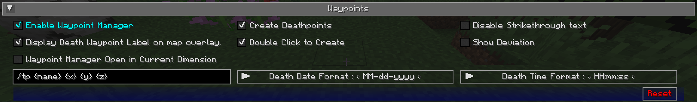

## **Paramètres des Points de Repère**

Cette catégorie vous permet de changer certains paramètres relatifs à la façon dont les [points de repère](../waypoints.md) se comportent et sont affichés.
Les points de repère ont également un certain nombre de paramètres individuels - vous pouvez en savoir plus
sur [la page des points de repère.](../waypoints.md)

{: .center}

## **Bascules**

Les paramètres de bascule **en gras** ci-dessous sont activés par défaut.

| Bascule                                              | Description                                                                                       |
|------------------------------------------------------|---------------------------------------------------------------------------------------------------|
| **Activer le Gestionnaire de Points de Repère**     | Activer le gestionnaire de points de repère - vous pouvez le désactiver si vous utilisez un autre  mod pour gérer les points de repère |
| **Créer des Points de Repère de Mort**              | Que des points de repère de mort soient créés lorsque vous mourrez                               |
| Désactiver le texte barré                            | Désactive le barré du texte du point de repère                                                   |                                                 |
| **Afficher l'Étiquette du Point de Repère de Mort  sur la superposition de carte** | Que le nom des points de repère de mort soit affiché sur votre minicarte et  carte en plein écran              |
| **Double clic pour créer**                           | Un double clic sur la carte en plein écran créera un point de repère à l'emplacement             |
| Montrer la Déviation                                 | Montrer la déviation vectorielle entre le joueur et le point de repère                           |
| Ouvrir le Gestionnaire de Points de Repère dans la Dimension Actuelle | Ouvre le gestionnaire de points de repère dans la dimension actuelle                             |

## **Autres Paramètres**

L'option par défaut pour chaque paramètre ci-dessous est marquée en **gras**.

| Paramètre                            | Options                                                                                                                                                                                                  | Description                                                                                                                                                                                                                                                                                                                                                                                                                                                                         |
|--------------------------------------|----------------------------------------------------------------------------------------------------------------------------------------------------------------------------------------------------------|-------------------------------------------------------------------------------------------------------------------------------------------------------------------------------------------------------------------------------------------------------------------------------------------------------------------------------------------------------------------------------------------------------------------------------------------------------------------------------------|
| Commande de Téléportation Personnalisée aux Points de Repère | Entrée de texte : **/tp {name} {x} {y} {z}**                                                                                                                                                              | La commande de téléportation qui devrait être utilisée lorsque vous vous téléportez à un point de repère, en utilisant les espaces réservés suivants : <ul><li>**{name}**: Votre nom de joueur</li><li>**{dim}**: La dimension cible</li><li>**{x}**: La coordonnée X du point de repère</li><li>**{y}**: La coordonnée Y du point de repère</li><li>**{z}**: La coordonnée Z du point de repère</li></ul> Ce paramètre est ignoré en solo ou si JourneyMap est installé sur un serveur ; la téléportation se fait sans commande dans ce cas. |
| Format de la Date de Mort             | <ul><li>**MM-dd-yyyy**</li><li>MM-dd-yy</li><li>dd-MM-yyyy</li><li>dd-MM-yy</li><li>yyyy-MM-dd</li><li>yy-MM-dd</li></ul>                                                                                   | Le format de texte de la date de mort, tel qu'affiché dans l'étiquette du point de repère de mort <ul><li>**dd**: Jour</li><li>**MM**: Mois</li><li>**yy**: Année (2 chiffres)</li><li>**yyyy**: Année (4 chiffres)</li></ul>                                                                                                                                                                                                                                                                                    |
| Format de l'Heure de Mort             | <ul><li>**HH:mm:ss**</li><li>H:mm:ss</li><li>HH:mm</li><li>H:mm</li><li>hh:mm:ss a</li><li>h:mm:ss a</li><li>hh:mm:ss</li><li>h:mm:ss</li><li>h:mm a</li><li>h:mm a</li><li>hh:mm</li><li>h:mm</li></ul>    | Le format de texte de l'heure de mort, tel qu'affiché dans l'étiquette du point de repère de mort                                                                                                                                                                                                                                                                                                                                                                                  |