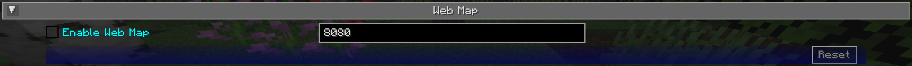

## **Paramètres de la Webmap**

La webmap est une manière totalement différente de voir votre carte - dans un navigateur web au lieu de directement depuis Minecraft. Cela vous permet d'avoir une vue de la carte visible sur un autre écran, ou même sur un autre appareil!

{: .center}

!!! info "Important"

    Il y a beaucoup de paramètres dans cette catégorie qui ne font rien pour le moment. À la place, la webmap est configurée en utilisant sa propre interface - voir la page de la webmap pour plus d'informations à ce sujet.

    C'est pourquoi seuls les paramètres qui font réellement quelque chose sont documentés ci-dessous.

## **Bascules**

Par défaut, **aucun** des paramètres de bascule suivants n'est activé. Vous devrez activer la webmap avant de pouvoir l'utiliser.

| Bascule         | Description                                         |
|-----------------|-----------------------------------------------------|
| Activer la Webmap | Que la webmap soit activée et accessible            |

!!! note "Note"

    Bien qu'il y ait une entrée pour fournir un port pour que la webmap l'utilise, elle est actuellement ignorée. JourneyMap essaiera d'utiliser le port 8080 par défaut - si celui-ci n'est pas disponible, il tentera de trouver un port qui l'est.

    Le port correct est toujours affiché dans le chat lorsque la webmap est activée.