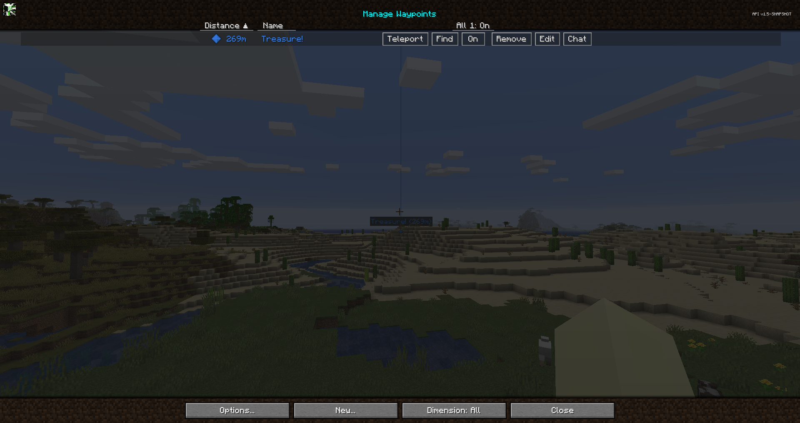

# **Points de Repère**

Les points de repère vous permettent de marquer des emplacements spécifiques sur votre carte afin de les suivre ou de les retrouver facilement plus tard.

De plus, des points de repère de mort sont créés lorsque, par exemple, vous êtes soufflé du bord d'une falaise par [un squelette jouant de la trompette](https://www.curseforge.com/minecraft/mc-mods/trumpet-skeleton-redooted).

Par défaut, ils sont affichés avec un faisceau lumineux coloré, et le nom ainsi que l'icône du point de repère seront visibles lorsque vous le regardez - mais ce comportement peut être modifié dans le [gestionnaire de paramètres](settings/overview.md). Les points de repère de mort peuvent également être désactivés dans ce menu, si vous le souhaitez.

!!! warning "Avertissement"
    Si vous utilisez OptiFine, il est probable que vous ne puissiez pas voir les points de repère dans le monde. Nous ne savons pas ce qui cause cela. Pour plus d'informations, veuillez consulter notre page de dépannage.

{: .center}

Vous pouvez créer des points de repère en utilisant l'une des méthodes suivantes :

- En appuyant sur ++b++ en jeu pour en créer un là où vous vous trouvez
- En double-cliquant ou en appuyant sur ++b++ dans la [carte plein écran](full-screen-map.md) pour créer un point de repère à l'emplacement du curseur
- En ouvrant le gestionnaire de points de repère et en créant manuellement un point de repère

## **Gestion des Points de Repère**

Le gestionnaire de points de repère vous permet de gérer tous vos points de repère en un seul endroit. Vous pouvez l'ouvrir de plusieurs façons :

- En appuyant sur ++ctrl+b++ en jeu
- En ouvrant la [carte plein écran](full-screen-map.md) et en cliquant sur le bouton du gestionnaire de points de repère en bas

{: .center}

Le gestionnaire de points de repère vous donne une liste de tous vos points de repère et offre plusieurs options pour les gérer. En bas, vous trouverez les boutons suivants :

- **Options** : Ouvre le [gestionnaire de paramètres](settings/overview.md)
- **Nouveau** : Crée un nouveau point de repère
- **Dimension** : Filtre les points de repère en fonction de la dimension
- **Fermer** : Ferme le gestionnaire de points de repère

Chaque point de repère a les options suivantes disponibles :

- **Téléportation** : Si autorisé par le serveur, se téléporter directement au point de repère
- **Localiser** : Trouver le point de repère sur la [carte plein écran](full-screen-map.md)
- **Activer/Désactiver** : Basculer la visibilité du point de repère en jeu
- **Supprimer** : Supprimer le point de repère
- **Modifier** : Ouvre l'éditeur de points de repère
- **Chat** : Copier les informations du point de repère dans la boîte de chat, comme montré ci-dessous :
{: .center}

## **Modifier les Points de Repère**

Lors de la création ou de la modification d'un point de repère, l'écran suivant est affiché :

{: .center}

L'éditeur de points de repère propose les paramètres suivants pour chaque point de repère :

- **Nom** : Le nom affiché pour le point de repère
- **Emplacement** : La position de ce point de repère
- **Dimensions** : Bascules pour les dimensions dans lesquelles le point de repère doit être activé
- **Activé** : Si ce point de repère est activé et doit être visible
- **Couleur** : La couleur du point de repère, définie par des valeurs rouge, vert et bleu

Vous pouvez également cliquer sur la roue des couleurs pour choisir une couleur, ou cliquer sur le bouton Couleur aléatoire pour obtenir une nouvelle couleur.

Voici ce que font les autres boutons :

- **Supprimer** : Supprimer entièrement le point de repère
- **Réinitialiser** : Annuler vos modifications du point de repère actuel
- **Enregistrer** : Enregistrer les modifications apportées au point de repère
- **Fermer** : Fermer l'éditeur et annuler vos modifications

## **Partager des Points de Repère**

À partir de JourneyMap 5.2, vous pouvez facilement partager des points de repère et des emplacements avec d'autres joueurs sur le serveur. L'objectif de cette fonctionnalité était d'ajouter de la commodité pour tous ceux qui utilisent JourneyMap, sans devenir gênant pour ceux qui ne l'utilisent pas. Si un joueur n'a pas JourneyMap, il verra tout de même l'emplacement dans son chat sous un format facile à lire.

Lorsqu'un emplacement correctement formaté apparaît dans le chat de Minecraft, vous pouvez **cliquer** dessus (pour créer un point de repère) ou **ctrl-clic** (pour voir l'emplacement dans votre carte plein écran).

## **Commandes de Points de Repère**

Dans JourneyMap 5.8.5, une nouvelle commande a été ajoutée, permettant de créer, supprimer et recharger des points de repère depuis le chat.

**Recharger les Points de Repère**

- Recharge les points de repère dans le répertoire sans avoir à redémarrer.
- Principalement utilisé lorsque des fichiers de points de repère sont ajoutés au dossier pendant que le jeu est en cours d'exécution.

```text
/jm reload
```

Les commandes de création et de suppression sont disponibles uniquement lorsque le serveur a JourneyMap installé et si le joueur dispose des autorisations d'opérateur. Vous pouvez trouver plus d'informations sur les commandes d'ajout et de suppression [ici](../Server%20Docs/Commands/waypoint_command.md).

## **Comment Partager des Points de Repère et des Emplacements**

Vous pouvez partager des points de repère et des emplacements de trois façons :

1. Dans le gestionnaire de points de repère, appuyez sur le nouveau bouton **Chat** à côté d'un point de repère. L'emplacement sera collé dans l'interface de chat pour vous. Ajoutez du contexte si vous le souhaitez, puis appuyez sur Entrée. Vous pouvez utiliser cette fonctionnalité avec /msg ou les canaux de serveur (si présents).
2. Dans l'interface de chat, tapez <code>/jm ~</code> et appuyez sur Entrée. La commande sera remplacée par votre emplacement actuel. Ajoutez des informations ou modifiez au besoin, puis appuyez sur Entrée.
3. Dans l'interface de chat, tapez manuellement un emplacement entre crochets. Voir les options de format d'emplacement ci-dessous :

## **Format d'Emplacement**

Un emplacement doit contenir au minimum les coordonnées x et z, mais les formats suivants sont possibles, et l'ordre utilisé n'a pas d'importance :

- [x:#, z:#]
- [x:#, y:#, z:#]
- [x:#, y:#, z:#, dim:#]
- [x:#, y:#, z:#, dim:#, nom:texte]
- [nom:texte, dim:#, x:#, z:#, y:#]

Un emplacement se compose de 2 paires ''nom:valeur'' ou plus, séparées par des virgules. Les valeurs suivantes sont prises en charge :

- x (entier) **requis**
- y (entier)
- z (entier) **requis**
- dim (entier)
- nom (chaîne de caractères, sans guillemets, sans virgules)