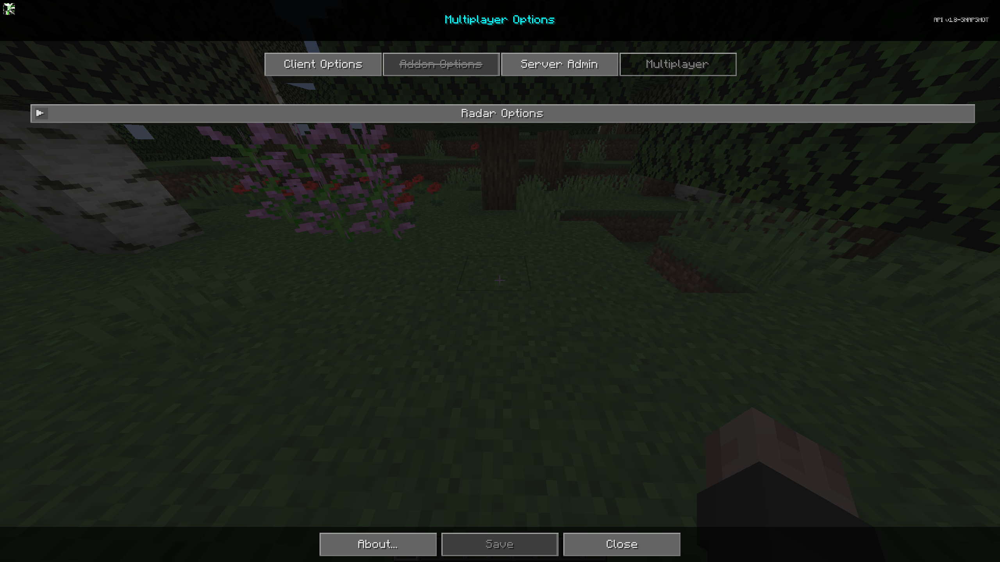
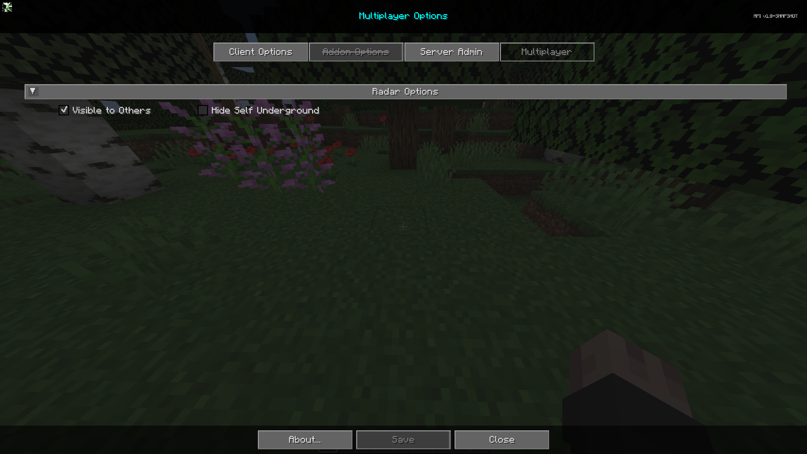

# **Paramètres**

La section Multijoueur est conçue pour donner aux utilisateurs le contrôle sur la manière dont ils sont vus par d'autres clients utilisant le mod JourneyMap, et comment ils sont affichés sur la carte. Cette section n'est déverrouillée que lorsque le serveur exécute le mod JourneyMap et peut être désactivée par le serveur.

{: .center}

Pour accéder à l'onglet Multijoueur, ouvrez la carte en plein écran et cliquez sur le bouton de paramètres en bas, ou appuyez sur la touche **o**. Enfin, en haut, cliquez sur l'onglet Multijoueur pour accéder aux paramètres multijoueurs du mod. Chaque entrée de la liste représente une catégorie spécifique de paramètres - cliquez dessus pour l'étendre et voir les paramètres à l'intérieur.

## **Options de Radar**

La section Options de Radar permet de contrôler comment les autres vous voient sur la carte. Notez que ces options ne fonctionnent que lorsque le radar étendu est activé.

{: .center}

## **Bascules**

| Bascule                | Description                                                                                                                        |
|------------------------|------------------------------------------------------------------------------------------------------------------------------------|
| Visible pour les autres | Cachez-vous pour ne pas être vu sur la carte. Remarque : les opérateurs peuvent toujours voir les joueurs, même s'ils se sont désactivés du radar des autres. |
| Cacher sous terre      | Empêche les autres de vous voir lorsque vous êtes sous terre.                                                                         |