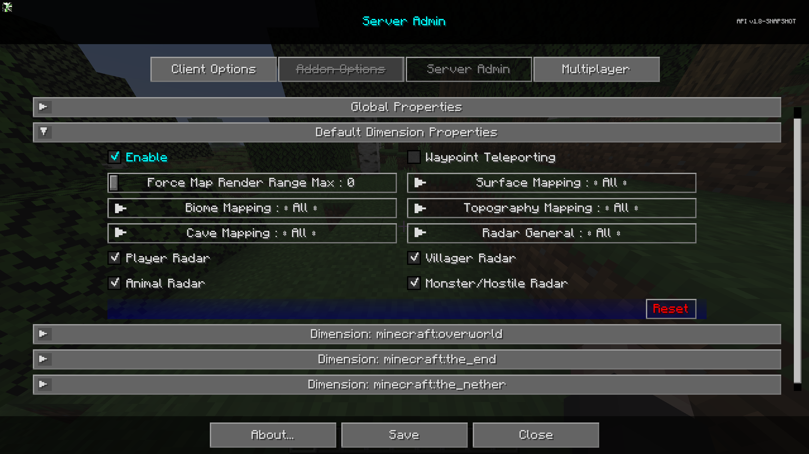

# **Propriétés de Dimension par Défaut**

La catégorie **Propriétés de Dimension par Défaut** contient des paramètres qui seront les paramètres par défaut pour toutes les nouvelles dimensions créées. Ces paramètres peuvent être remplacés au niveau de chaque dimension.

{: .center}

## **Commutateurs**

| Commutateur                | Description                                                                              |
|----------------------------|------------------------------------------------------------------------------------------|
| Activer                    | Activer cette dimension remplacera les propriétés globales pour cette dimension.         |
| Téléportation de Point de Repère | Permet ou empêche la téléportation via le gestionnaire de points de repère et le menu contextuel plein écran. |
| Radar des Joueurs          | Indique si les joueurs peuvent voir d'autres joueurs sur la carte.                     |
| Radar des Villageois       | Indique si les joueurs peuvent voir des villageois sur la carte.                       |
| Radar des Animaux          | Indique si les joueurs peuvent voir des animaux sur la carte.                          |
| Radar des Monstres/Hostiles| Indique si les joueurs peuvent voir des monstres ou des entités hostiles sur la carte. |