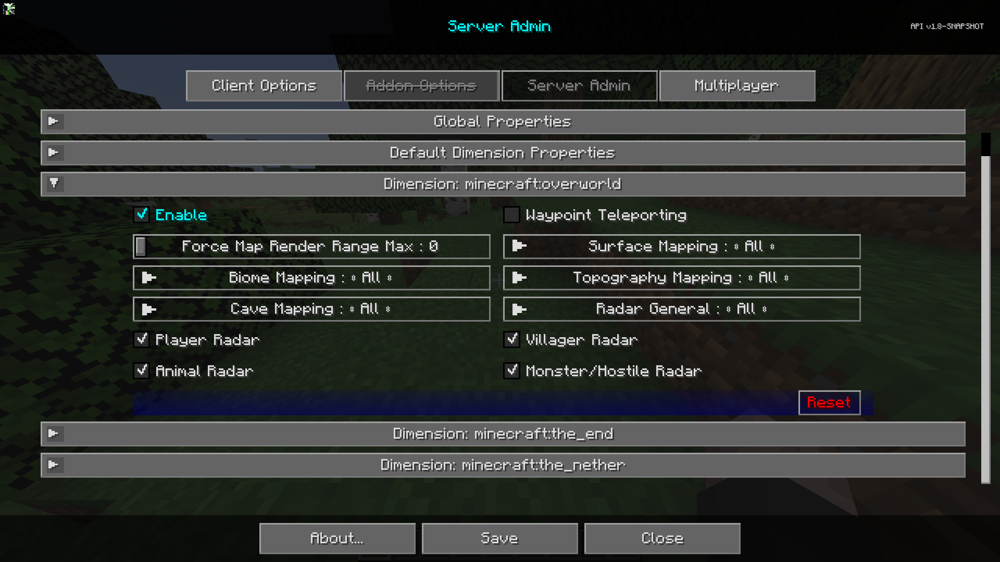

# **Dimension : minecraft:overworld**

La catégorie **Dimension : minecraft:overworld** contient des paramètres qui seront les paramètres par défaut pour la dimension de l'Overworld.

{: .center}

## **Commutateurs**

| Commutateur                | Description                                                                              |
|----------------------------|------------------------------------------------------------------------------------------|
| Activer                    | Activer cette dimension remplacera les propriétés globales pour cette dimension.         |
| Téléportation de Point de Repère | Permet ou empêche la téléportation via le gestionnaire de points de repère et le menu contextuel plein écran. |
| Radar des Joueurs          | Indique si les joueurs peuvent voir d'autres joueurs sur la carte.                     |
| Radar des Villageois       | Indique si les joueurs peuvent voir des villageois sur la carte.                       |
| Radar des Animaux          | Indique si les joueurs peuvent voir des animaux sur la carte.                          |
| Radar des Monstres/Hostiles| Indique si les joueurs peuvent voir des monstres ou des entités hostiles sur la carte. |

## **Autres Paramètres**

L'option par défaut pour chaque paramètre ci-dessous est marquée par un texte **gras**.

| Paramètre                    | Options                                           | Description                                                                                                                                              |
|------------------------------|---------------------------------------------------|----------------------------------------------------------------------------------------------------------------------------------------------------------|
| Forcer la Portée de Rendu de Carte Max | <ul><li>Portée : 0 - 32 **Par défaut 0**</li></ul>  | Force tous les joueurs à une distance maximale de rendu de chunk pour la carte.                                                                            |
| Cartographie de Surface       | <ul><li>**Tout**</li><li>Administrateur</li><li>Aucun</li></ul> | Cartographie de Surface pour Tout, Administrateurs, Aucun                                                                                                          |
| Cartographie de Biome         | <ul><li>**Tout**</li><li>Administrateur</li><li>Aucun</li></ul> | Cartographie de Biome pour Tout, Administrateurs, Aucun.                                                                                                           |
| Cartographie de Topographie    | <ul><li>**Tout**</li><li>Administrateur</li><li>Aucun</li></ul> | Cartographie de Topographie pour Tout, Administrateurs, Aucun.                                                                                                      |
| Cartographie de Grottes       | <ul><li>**Tout**</li><li>Administrateur</li><li>Aucun</li></ul> | Cartographie de Grottes pour Tout, Administrateurs, Aucun.                                                                                                          |
| Radar Général                 | <ul><li>**Tout**</li><li>Administrateur</li><li>Aucun</li></ul> | <ul><li>Tout : Le radar fonctionne pour tout le monde</li><li>Administrateur : Désactive complètement le radar pour tout le monde sauf les administrateurs</li><li>Aucun : Le radar est désactivé pour tout le monde.</li></ul> |