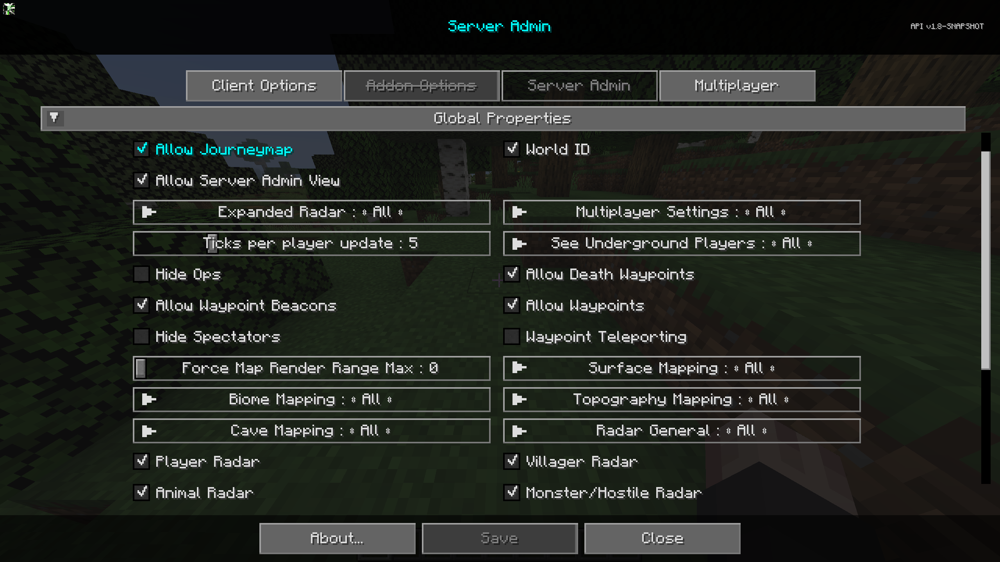

# **Global Properties**

La catégorie **Propriétés Globales** contient des paramètres qui affectent le comportement côté serveur du mod. Ce sont les propriétés par défaut du serveur.

{: .center}

## **Commutateurs**

| Commutateur                | Description                                                                                                                                                                                                                                                                                                                                                                                               |
|----------------------------|-----------------------------------------------------------------------------------------------------------------------------------------------------------------------------------------------------------------------------------------------------------------------------------------------------------------------------------------------------------------------------------------------------------|
| Autoriser JourneyMap        | Permet ou non à JourneyMap de fonctionner pour les joueurs non administrateurs.                                                                                                                                                                                                                                                                                                                          |
| ID du Monde                | Activer ce paramètre changera le répertoire de sauvegarde pour les données de cartographie de ce serveur. Si désactivé puis activé sur un serveur actif, toutes les données de cartographie des utilisateurs seront réinitialisées. Ce paramètre est principalement utilisé pour éviter l'écrasement des cartes et des paramètres dans une configuration multi-monde lorsque les serveurs n'ont pas de noms uniques. |
| Autoriser la Vue Admin Serveur | Permet aux utilisateurs non administrateurs de voir l'écran d'administration du serveur en mode lecture seule.                                                                                                                                                                                                                                                                                           |
| Cacher les Admins                | Cache les administrateurs sur le radar lorsque le radar étendu est activé.                                                                                                                                                                                                                                                                                                                                                         |
| Autoriser les Waypoints de Mort  | Permet de créer des points de repère à la mort de l'utilisateur.                                                                                                                                                                                                                                                                                                                                                                             |
| Autoriser les Balises de Waypoint | Permet l'affichage des balises dans le jeu. (Ne désactive pas les points de repère sur la carte)                                                                                                                                                                                                                                                                                                       |
| Autoriser les Waypoints         | Permet d'utiliser les points de repère. Désactive entièrement l'affichage des points de repère sur la carte, dans le jeu, et les écrans associés.                                                                                                                                                                                                                                                                                        |
| Cacher les Spectateurs         | Cache les spectateurs sur le radar.                                                                                                                                                                                                                                                                                                                                                                  |
| Téléportation de Point de Repère    | Permet ou empêche la téléportation via le gestionnaire de points de repère et le menu contextuel plein écran.                                                                                                                                                                                                                                                                                                                  |
| Radar des Joueurs            | Indique si les joueurs peuvent voir d'autres joueurs sur la carte.                                                                                                                                                                                                                                                                                                                                                              |
| Radar des Villageois          | Indique si les joueurs peuvent voir des villageois sur la carte.                                                                                                                                                                                                                                                                                                                                                                  |
| Radar des Animaux            | Indique si les joueurs peuvent voir des animaux sur la carte.                                                                                                                                                                                                                                                                                                                                                                    |
| Radar des Monstres/Hostiles   | Indique si les joueurs peuvent voir des monstres ou des entités hostiles sur la carte.                                                                                                                                                                                                                                                                                                                                               |

## **Autres Paramètres**

L'option par défaut pour chaque paramètre ci-dessous est marquée par un texte **gras**.

| Paramètre                    | Options                                           | Description                                                                                                                                              |
|------------------------------|---------------------------------------------------|----------------------------------------------------------------------------------------------------------------------------------------------------------|
| Radar Étendu             | <ul><li>**Tout**</li><li>Administrateur</li><li>Aucun</li></ul> | Permet aux joueurs de voir les autres joueurs sur la carte en dehors de la portée de rendu, partout dans leur dimension actuelle.                                             |
| Paramètres Multijoueurs       | <ul><li>**Tout**</li><li>Administrateur</li><li>Aucun</li></ul> | Permet à Tous les joueurs, aux administrateurs, ou à Aucun joueur d'utiliser le menu des paramètres multijoueurs.                                                                       |
| Ticks par mise à jour des joueurs    | <ul><li>Plage : 1 - 20 **Par défaut 5**</li></ul>  | Fréquence à laquelle le serveur enverra les mises à jour de la position des joueurs.                                                                                                  |
| Voir les joueurs souterrains    | <ul><li>**Tout**</li><li>Administrateur</li><li>Aucun</li></ul> | Permet d'afficher les joueurs souterrains sur le radar.                                                                                                    |
| Forcer la Portée de Rendu de Carte Max | <ul><li>Plage : 0 - 32 **Par défaut 0**</li></ul>  | Force tous les joueurs à une distance maximale de rendu de chunk pour la carte.                                                                                        |
| Cartographie de Surface            | <ul><li>**Tout**</li><li>Administrateur</li><li>Aucun</li></ul> | Cartographie de Surface pour Tout, Administrateurs, Aucun                                                                                                                       |
| Cartographie de Biome              | <ul><li>**Tout**</li><li>Administrateur</li><li>Aucun</li></ul> | Cartographie de Biome pour Tout, Administrateurs, Aucun.                                                                                                                        |
| Cartographie de Topographie         | <ul><li>**Tout**</li><li>Administrateur</li><li>Aucun</li></ul> | Cartographie de Topographie pour Tout, Administrateurs, Aucun.                                                                                                                   |
| Cartographie de Grottes               | <ul><li>**Tout**</li><li>Administrateur</li><li>Aucun</li></ul> | Cartographie de Grottes pour Tout, Administrateurs, Aucun.                                                                                                                         |
| Radar Général              | <ul><li>**Tout**</li><li>Administrateur</li><li>Aucun</li></ul> | <ul><li>Tout : Le radar fonctionne pour tout le monde</li><li>Administrateur : Désactive complètement le radar pour tout le monde sauf les administrateurs</li><li>Aucun : Le radar est désactivé pour tout le monde.</li></ul> |