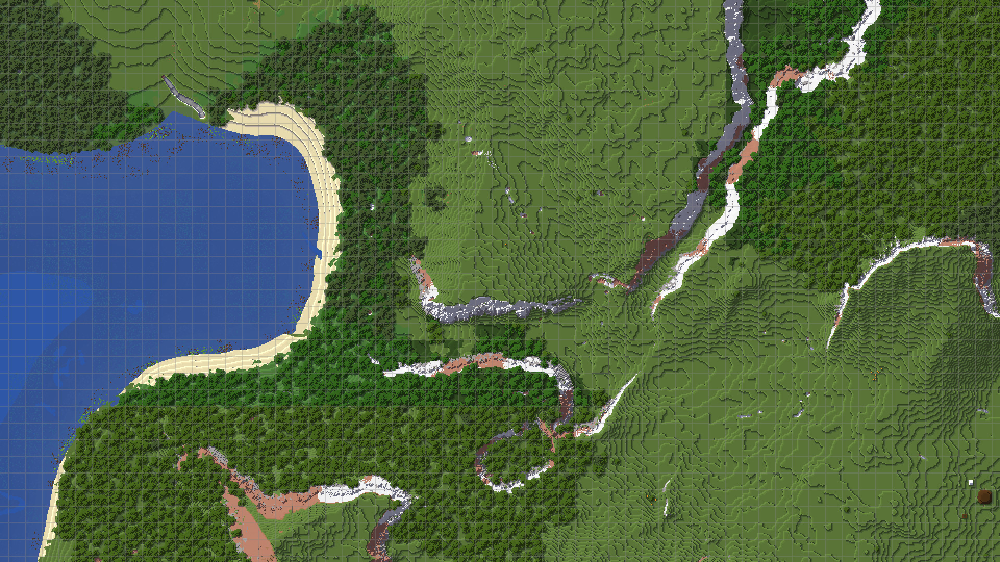

## **Accueil**

JourneyMap est un mod de cartographie populaire pour Minecraft. Originellement publié par techbrew en 2011, il est devenu de plus en plus fort et est aujourd'hui le mod de cartographie le plus populaire au monde.

{: .center}

JourneyMap inclut une minicarte en jeu et une carte en plein écran, ainsi qu'une carte web qui peut être visualisée dans un navigateur.

Si vous souhaitez un mod de cartographie riche en fonctionnalités et facile à utiliser, pourquoi ne pas essayer JourneyMap ? Vous pouvez le trouver sur [CurseForge](https://www.curseforge.com/minecraft/mc-mods/journeymap) ou [Modrinth](https://modrinth.com/mod/journeymap) et l'installer comme n'importe quel autre mod [Fabric](https://fabricmc.net/), [Quilt](https://quiltmc.org), [Forge](https://forums.minecraftforge.net/) ou [NeoForge](https://neoforged.net/) - ou continuez à lire si vous avez besoin d'aide.

## **Premiers Pas**

-   [Télécharger JourneyMap](Client Docs/installing.md)
-   [Utiliser le Gestionnaire d'Options](Client Docs/settings/overview.md)
-   [Partager des Points de Repère](Client Docs/waypoints.md/#sharing-waypoints)
-   [Obtenir de l'Aide](About/support.md)

## **En Savoir Plus**

-   [Utiliser les Raccourcis Clavier (Keybindings)](Client Docs/basic-usage.md/#key-mappings)
-   [Personnaliser les Cartes Topographiques](Tools and Customisation/topographic.md)
-   [Cartographier un serveur multijoueur](Tools and Customisation/multiplayer-server.md)
-   [Générer des cartes à l'échelle personnalisée](Tools and Customisation/journeymap-tools.md)

## **Sujets Avancés**

-   [Utilisation dans un Modpack](About/licensing.md)
-   [Intégrer votre mod](Tools and Customisation/integration.md)
-   [Créer des icônes de mobs personnalisées](Tools and Customisation/custom-mob-icons.md)
-   [Créer un Thème d'Interface Utilisateur (Skin)](Tools and Customisation/ui-themes.md)
-   [Traduire JourneyMap dans votre langue](Contributing/translate-mod.md)